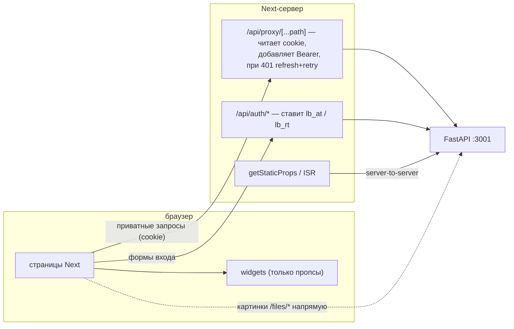
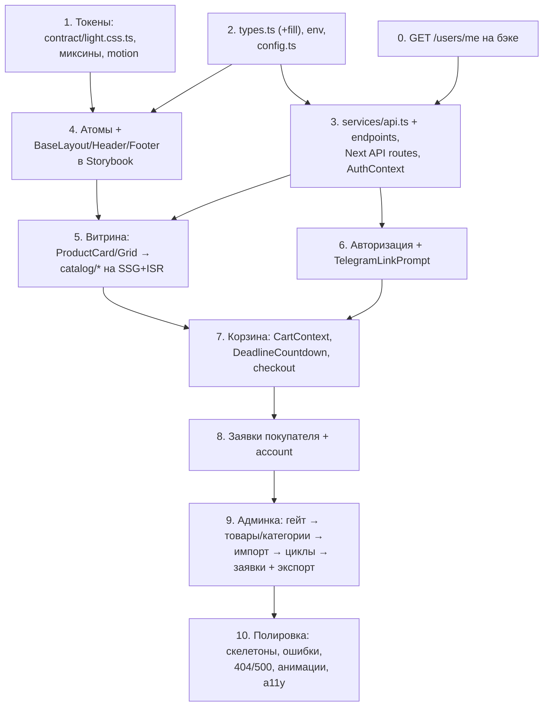

# План: фронтенд Lulu Beauty (`packages/widgets` + `apps/website`)

Продолжение [`PLAN.md`](./PLAN.md) — этот файл раскрывает пп. **14–15** его раздела «Порядок реализации». Бэкенд (`apps/api`) описан там же; здесь только фронт.

## Контекст

Бэкенд `apps/api` реализован — пп. 1–13 и 16 в `PLAN.md` закрыты: auth с Telegram-OTP, каталог, импорт xlsx/csv, циклы-дедлайны, корзина, заявки, планировщик, экспорт в Excel. Открытыми остались общие типы, API-клиент и весь фронтенд.

Фактическое состояние фронта на момент написания плана:

- `packages/widgets/src/atoms` — **два атома**: `AppLink` и `AppImage`, оба тонкие обёртки над `ServicesContext`. Директорий `molecules/`, `organisms/`, `templates/`, `hooks/` не существует, хотя subpath'ы для них уже прописаны в `packages/widgets/package.json`.
- `styling/themes/contract.css.ts` — контракт практически пуст: `color.neutral: {}` плюс два шрифта. При этом `styling/lib/*` богат (18 модулей: `rem`, `color`, `media`, `transition`, `shadow`, `border`, `nested`, `conditions`, …) и готов к переиспользованию; `styling/mixin/` содержит только `flex.ts`.
- `apps/website/src/pages` — **только `_app.tsx`**, где уже настроены шрифты `Inter`/`Eloqua`. Нет ни страниц, ни `_document.tsx`, ни API-клиента.
- Тестовых файлов в `packages/widgets/src` нет вообще.

## Ключевые решения (утверждены с пользователем)

- **Рендеринг:** гибрид — каталог и карточка товара через `getStaticProps` + ISR (ради SEO), корзина/заявки/админка — клиентский рендер.
- **Хранение JWT:** `httpOnly`-cookie, выставляемые тонкими Next API routes (`/api/auth/*`); браузер никогда не видит токены.
- **Админка:** полная, `/admin/*` в том же Next-приложении (товары, категории, картинки, импорт, календарь дедлайнов, заявки со сменой статуса, экспорт).
- **Язык:** только русский, без i18n-библиотеки. Валюта KGS, таймзона `Asia/Bishkek` — как в `apps/api/app/config.py` (`CURRENCY`, `CYCLE_TIMEZONE`).
- **Картинки:** расширить контракт `IImage`/`IImageComponentProps` под режим `fill` (см. §1.2) — API не отдаёт размеры картинок.
- **Тесты widgets:** дописать шаблон теста в генератор и покрыть точечно компоненты с логикой (см. §1.9).
- **Подтверждение заявки — в Telegram, а не звонком.** Владелец не звонит покупателю, чтобы подтвердить заявку: он жмёт «Подтвердить» в чате бота, покупателю уходит уведомление, и уже **после** подтверждения выдача обсуждается лично. Копирайт всего флоу (главная, корзина, оформление, тексты бота) обещает именно это — формулировок «дождитесь звонка» / «с вами свяжутся по телефону» быть не должно. Телефон в админке остаётся `tel:`-ссылкой как канал личной связи, а не как шаг подтверждения.

## Расхождения с текущим кодом

Найдены при сверке проекта с кодом. Каждое — реальная ловушка, в которую упрётся реализация, если не учесть заранее.

1. ~~**Генератор не скаффолдит тест.**~~ — **закрыто на шаге 4**: в `tools/templates/react/component/` добавлен `__name__.test.tsx`, генератор выдаёт пять файлов. ~~Тестов в `src` нет → `npm test` падает с кодом 1 («No test files found»).~~ — **закрыто на шаге 1**: появился `src/styling/styling.test.ts`, `npm test` зелёный.
2. **Генератор требует двух ручных дописываний на каждый компонент.** Шаблон `__name__.tsx` импортирует `I__name__Props` из `../../types`, а `story.stories.tsx` — `feed__name__` из `../../stories/feed`. Значит **на каждый сгенерированный компонент** нужно добавить интерфейс пропсов в `src/types.ts` и фабрику фикстуры в `src/stories/feed.ts` (рядом с существующими `feedImage`/`feedLink`), иначе `tsc --noEmit` краснеет сразу после генерации.
3. ~~**`next/image` заблокирует картинки товаров.**~~ — **закрыто на шаге 5** (на шаге 2 закрывалось `remotePatterns`, но этого оказалось мало: Next 16 отказывается ходить за картинкой на хост, который резолвится в приватный IP, — «resolved to private ip», и `http://localhost:3001/files/*` не спасал ни один паттерн). Решение: рерайт `/files/:path*` → `${API_BASE_URL}/files/:path*` в `next.config.js` плюс нормализация абсолютного адреса в относительный в адаптере `src/components/Image.tsx`. Картинки стали same-origin — заодно в проде не нужно светить адрес API. Опасный флаг `images.dangerouslyAllowLocalIP` не понадобился.
4. ~~**Telegram deep-link с payload не сработает.**~~ — **учтено на шаге 6**: `TelegramLinkPrompt` ведёт на чистый `https://t.me/<TELEGRAM_BOT_USERNAME>`, проверено в браузере (`href` без параметров). Причина ниже осталась для истории.
   **Telegram deep-link с payload не сработает.** `apps/api/app/telegram/bot.py:21` — `@dispatcher.message(F.text == "/start")`, **точное** сравнение. Ссылка `t.me/<bot>?start=<nonce>` пришлёт текст `"/start <nonce>"`, который уйдёт в `handle_fallback` и вернёт «Send /start to link your phone number» без кнопки «поделиться контактом». `TelegramLinkPrompt` обязан вести на **чистый** `https://t.me/<TELEGRAM_BOT_USERNAME>`, без `?start=`.
5. ~~**`GET /users/me` отсутствует.**~~ — **закрыто**, модуль `app/users/` реализован (`GET`/`PATCH /users/me`), см. `## Done` в `PLAN.md`.
6. ~~**`apps/website` объявляет скрипт `barrels`, но `.barrelsby.json` в нём нет**~~ — **закрыто на шаге 2**: скрипт удалён, корневой `npm run barrels` гоняет только `widgets`.
7. **`GET /products?category=` фильтрует по слагу, а не по id** (`ProductService.list_public(category_slug)`, `apps/api/app/catalog/service.py:76`), при этом `ProductResponse` отдаёт `categoryId`, а не вложенную категорию. Фронт обязан держать маппинг `id → slug` из `GET /categories`.

## Нюансы контрактов API

Подтверждено по коду роутеров; на эти детали легко наступить.

- **camelCase-алиасы в `Query`/`Form` проставлены вручную и работают только там, где проставлены**: `GET /admin/orders?cycleId=&status=&page=&pageSize=`, `GET /admin/products?inStock=&includeDeleted=&pageSize=`, `GET /admin/export/orders?cycleId=`. У **публичного** `GET /products` алиасов нет и параметры остаются snake_case: `category`, **`in_stock`**, `page`, **`page_size`** (плюс `q` — односложный, одинаков в обоих стилях). Расхождение осознанное: публичный контракт не меняли, чтобы не ломать уже пишущийся фронт. `alias_generator` из `CamelModel` на `Query`/`Form` не распространяется, только на тела запросов/ответов.
- **`GET /products?page_size=` ограничен `le=100`** — `getStaticPaths` для `catalog/[slug]` обязан пагинировать в цикле, а не пытаться забрать все слаги одним запросом.
- **`PATCH /cart/items/{id}` без активного цикла отдаёт `409 no_active_cycle`** (исправлено; раньше маскировалось под `404 cart_item_not_found`).
- **`{id}` в `/cart/items/{id}` — это `productId`, а не id позиции корзины** (`app/cart/router.py`: `@router.patch("/items/{product_id}")`, `@router.delete("/items/{product_id}")`). Своего идентификатора у `CartItemResponse` нет вообще, поэтому `ICartItem` адресуется товаром — учесть в `CartContext` и `QuantityStepper` (шаг 7).
- **`GET /cycles/active` отдаёт `404 no_active_cycle`**, когда активного цикла нет. Это нормальное состояние витрины, а не сбой — страницы обязаны рендериться и в нём.
- **`POST /auth/logout` требует `refreshToken` в теле** — Next-route берёт его из cookie.
- **`POST /auth/refresh` ротирует refresh-токен** (старый помечается `revoked_at`), значит прокси обязан переписывать **обе** cookie, а не только access.
- **`POST /auth/register` и `POST /auth/login` токенов не возвращают** — только `{message, purpose}`; пара токенов приходит из `POST /auth/verify-otp`.
- **Лимиты загрузки** (`apps/api/app/catalog/router.py`): картинки — 5 MB, `image/jpeg|image/png|image/webp`; файл импорта — 10 MB. `FileDropzone` валидирует ровно по ним.
- **Значения enum:** `OrderStatus` = `PENDING|CONFIRMED|READY|COMPLETED|CANCELLED`, `CycleStatus` = `UPCOMING|ACTIVE|CLOSED`, `Role` = `CUSTOMER|ADMIN`, `OtpPurpose` = `REGISTER|LOGIN`.
- **Машинные коды ошибок** приходят в `detail`: `no_active_cycle`, `cart_is_empty`, `cart_item_not_found`, `cycle_has_orders`, `cycle_not_found`, `deadline_must_be_future`, `slug_already_exists`, `product_not_found`, `product_image_not_found`, `category_not_found`, `order_not_found`, `user_not_found`, `otp_resend_too_soon`, `phone_not_verified`, `phone_already_registered`, `invalid_credentials`, `invalid_token`, `invalid_refresh_token`, `admin_only`, `not_authenticated`, `image_too_large`, `unsupported_image_type`, `import_file_too_large`.
- **Форма ответов, изменённая под нужды фронта** (см. `## Done` в `PLAN.md`):
  - `GET /admin/orders` отдаёт **`PageResponse`**, а не голый список, а его элементы — `AdminOrderResponse` с `customerName`/`customerPhone`. То же тело возвращает `PATCH /admin/orders/{id}/status`. Покупательские `GET /orders`, `GET /orders/{id}` и `POST /orders/checkout` остаются `OrderResponse` **без** полей покупателя.
  - Позиции корзины и заявки несут `productSlug` и `productImageUrl` (у заявки — снапшот на момент чекаута, у корзины — актуальные значения товара). `productImageUrl` может быть `null`.
  - Появились `GET /users/me` и `PATCH /users/me` (`{id, phone, name, role, phoneVerified, telegramLinked}`), `GET /admin/products` (`PageResponse[ProductResponse]`, `includeDeleted`), `POST /admin/products/{id}/restore`, поиск `GET /products?q=`.
  - `GET /admin/export/orders` отдаёт `Content-Disposition` по RFC 5987 (`filename` + `filename*`) — для скачивания на клиенте имя файла нужно брать из `filename*`, иначе получится ASCII-фолбэк из дефисов.

## Ключевой архитектурный принцип

По `CLAUDE.md`: **`widgets` — строго презентационная библиотека**. Никакого `fetch`, никаких знаний об эндпоинтах, никакого хранения токенов.

- **В `widgets`:** визуальные блоки (атомы → шаблоны), UI-хуки (раскрытие, таймер, брейкпоинты, focus-trap), UI-контексты (тосты, подтверждения), общие JSON-типы.
- **В `apps/website`:** API-клиент, `AuthContext`/`CartContext`, все data-хуки, Next API routes, страницы.
- Организмы `widgets` получают данные и колбэки **пропсами** (`products`, `onAddToCart`, `isPending`) — они не знают, откуда данные.



---

## Часть 1. `packages/widgets`

### 1.1. Дизайн-токены (делать **первым** — от них зависит всё остальное)

- **`styling/themes/contract.css.ts` + `light.css.ts`** — расширить контракт: `color` (`neutral.50…900`, `brand`/`accent` под бьюти-тематику, семантические `success`/`warning`/`danger`/`info`, `surface`/`background`/`text`/`border`), `radius`, `shadow`, `zIndex` (header/drawer/modal/toast), `space`. Ключи обоих файлов должны совпадать один в один — `createTheme` падает на несовпадении структуры.
- **`styling/mixin/`** — добавить к существующему `flex.ts`: `grid.ts`, `truncate.ts` (line-clamp для названий товаров), `visuallyHidden.ts`, `focusRing.ts`, `container.ts` (обёртка по `wrapperWidth`/`wrapperPadding` из `properties.css.ts`).
- `styling/lib/*` — **переиспользовать, не дублировать**: `rem`, `color`, `media` (работает с `src/breakpoints.ts`), `transition` (`trnDelayVar`/`trnEasingVar`), `shadow`, `border`, `nested`, `conditions`.
- **Анимации:** установить `motion` (`npm install motion -w widgets`), импорт **только** из `motion/react`, не из устаревшего `framer-motion`. Нужен для Drawer/Modal/Toast/Accordion. Тайминги и easing брать через скилл `/motion` (`.claude/skills/motion/`), а не наугад; офлайновые `best-practices/` под скиллом работают и без MCP-сервера.
- После правок темы: `npm run barrels -w widgets` (`mixin`/`lib` под barrelsby).

### 1.2. Общие типы — `src/types.ts`

Дописать в существующий файл. Subpath `widgets/types` уже есть в `exports`/`typesVersions`, манифест править **не нужно**. Все поля — **camelCase**, ровно как отдаёт бэк (`CamelModel`); enum — **строковые union-типы**, не TS enum:

```ts
type OrderStatus = 'PENDING' | 'CONFIRMED' | 'READY' | 'COMPLETED' | 'CANCELLED'
type CycleStatus = 'UPCOMING' | 'ACTIVE' | 'CLOSED'
type OtpPurpose  = 'REGISTER' | 'LOGIN'
type Role        = 'CUSTOMER' | 'ADMIN'
```

Интерфейсы 1:1 со схемами `apps/api/app/*/schemas.py`:

- `ICategory` — `id`, `name`, `slug`, `sortOrder`.
- `IProductImage` — `id`, `url`, `alt`, `sortOrder`, `isPrimary`.
- `IProduct` — `id`, `name`, `slug`, `description`, `priceCents`, `categoryId`, `inStock`, `images`.
- `IPage<T>` — `items`, `total`, `page`, `pageSize`.
- `ICartItem`/`ICart` — `cycleId`, `cycleDeadlineAt`, `items`, `totalCents`.
- `IOrderItem`/`IOrder` — `id`, `cycleId`, `status`, `totalCents`, `note`, `createdAt`, `items`.
- `IOrderCycle` — `id`, `deadlineAt`, `label`, `status`, `reminderSentAt`, `closedAt`.
- `IAuthUser`, `IImportRowError` (`row`, `message`), `IImportSummary` (`created`, `updated`, `errors`).

Даты — ISO-строки.

**Правка контракта картинок.** API отдаёт у картинки только `url`/`alt`, а существующий `IImage` требует `width`/`height`. Решение: в `IImage` сделать `width`/`height` **необязательными**, в `IImageComponentProps` добавить `fill?: boolean`. Обе реализации `components.Image` обрабатывают ветку `fill`:

- Storybook-заглушка (`src/stories/wrapper/components/Image.tsx`) — обычный `` с `object-fit: cover`.
- Адаптер сайта — `next/image` с `fill` + `sizes` внутри бокса с `aspect-ratio`.

`feedImage` в `src/stories/feed.ts` остаётся с размерами; добавить `feedProductImage()` — без них.

Туда же, в `types.ts`, кладутся интерфейсы пропсов всех новых компонентов (`IButtonProps`, `IProductCardProps`, …) — этого требует шаблон генератора (расхождение №2).

### 1.3. Атомы

Создавать **только** через `npm run generate -w widgets` → `Atom`, **никогда не создавать папки руками**.

| Атом | Назначение |
|---|---|
| `Button` | варианты primary/secondary/ghost/danger, размеры, `isLoading`, иконки; ссылочный режим через `AppLink` |
| `IconButton` | удалить позицию, закрыть модалку |
| `Input` | текст/тел/пароль: label, error, hint, префикс |
| `PasswordInput` | `Input` + переключатель видимости |
| `PhoneInput` | маска `+996 …`, нормализация в E.164 под `PHONE_PATTERN` бэка (`apps/api/app/common/phone.py`) |
| `OtpInput` | 6 ячеек, автопереход, вставка кода целиком |
| `Textarea` | `note` при чекауте (max 2000), описание товара в админке |
| `Select` | категория, статус заявки |
| `Checkbox` / `Switch` | `inStock`-тумблер, фильтры |
| `Badge` | статус заявки/цикла, «нет в наличии» |
| `Price` | `priceCents` → `1 250 сом` через `Intl.NumberFormat('ru-RU')` |
| `Spinner`, `Skeleton` | загрузка каталога/таблиц |
| `Heading`, `Text` | типографика на токенах |
| `Chip` | фильтр по категории |
| `Alert` | ошибки API/форм |
| `FileInput` | картинки товара, импорт xlsx/csv |
| `Container` | ширина по `wrapperWidth` |
| `Divider`, `VisuallyHidden`, `Portal` | вспомогательные (`Portal` — база для Modal/Drawer/Toast) |

`AppLink`/`AppImage` уже есть — переиспользовать, а не дублировать.

### 1.4. Молекулы

`FormField` (label + control + error), `QuantityStepper` (`− n +`), `ProductCard`, `CartItemRow`, `CategoryFilter`, `Pagination` (под `IPage<T>`), `DeadlineCountdown` (на `useCountdown`), `EmptyState`, `Toast`, `Tabs`, `Breadcrumbs`, `ProductGallery` (главная картинка + миниатюры), `FileDropzone` (drag&drop + валидация типа/размера ровно по лимитам бэка), `StatusSelect`, `SearchField`.

### 1.5. Организмы

- **Каркас:** `Header` (лого, навигация, счётчик корзины, вход/профиль), `Footer`, `MobileMenu` (Drawer), `Modal`/`ConfirmDialog` (focus-trap, блокировка скролла), `ToastViewport`.
- **Витрина:** `ProductGrid` (карточки + скелетоны + пустое состояние), `ProductDetails` (галерея + цена + наличие + добавление в корзину), `CartPanel` (позиции + итог + дедлайн цикла + «оформить»), `CheckoutForm` (`note` + подтверждение), `OrderList`/`OrderCard`.
- **Авторизация:** `RegisterForm`, `LoginForm`, `OtpVerifyForm`, `TelegramLinkPrompt` — карточка с инструкцией «нажмите Start у бота и поделитесь контактом» плюс **чистая** ссылка `https://t.me/<TELEGRAM_BOT_USERNAME>` без `?start=` (расхождение №4). Это тот самый UI-флоу ожидания привязки, из-за отсутствия которого в шаге 6 бэкенда отложили nonce-deep-link.
- **Админка:** `AdminProductsTable`, `AdminProductForm` (+ загрузка/удаление картинок, `isPrimary`), `AdminCategoriesPanel`, `AdminImportPanel` (dropzone + таблица `{created, updated, errors[{row, message}]}`), `AdminCycleCalendar` (сетка месяца, создание/перенос/удаление дедлайна, подсветка активного цикла), `AdminOrdersTable` (фильтр по циклу, смена статуса, кнопка экспорта).

### 1.6. Шаблоны

`BaseLayout` (Header + main + Footer), `CatalogTemplate` (фильтры + грид + пагинация), `ProductTemplate`, `CartTemplate`, `AuthTemplate` (узкая центрированная карточка), `AccountTemplate`, `AdminLayout` (сайдбар + контент), `ErrorTemplate` (404/500).

### 1.7. Хуки `src/hooks/`

Директории ещё нет, но barrelsby уже настроен на `./src/hooks`, а subpath `widgets/hooks` уже в манифесте. **Только UI, без API:**

`useDisclosure`, `useCountdown(deadlineAt)` → `{days, hours, minutes, seconds, isExpired}`, `useMediaQuery`/`useBreakpoint` (на существующем `src/breakpoints.ts`), `useLockBodyScroll`, `useOnClickOutside`, `useFocusTrap`, `useDebouncedValue`, `useControllableState`, `useIsomorphicLayoutEffect`, `useToast` (потребитель `ToastContext`).

### 1.8. Контексты `src/contexts/`

- **`ServicesContext`** (уже есть, на `unmanagedContainer` из `src/utils/unstated.tsx`) — оставить как контейнер инъекции `Link`/`Image`; сайт прокидывает адаптеры поверх `next/link`/`next/image`, Storybook — заглушки из `src/stories/wrapper`.
- **`ToastContext`** — очередь уведомлений (чистый UI).
- **`ConfirmContext`** — императивный `confirm()` для опасных действий админки (удаление товара/цикла).
- **`AuthContext`/`CartContext` — НЕ здесь**, они в `apps/website` (см. принцип выше).

### 1.9. Обязательное сопровождение

- Генератор даёт `*.tsx` + `*.css.ts` + `index.ts` + `story.stories.tsx`. **Дописать шаблон `__name__.test.tsx`** в `tools/templates/react/component/` и добавить `@testing-library/react` + `jsdom` в devDependencies `widgets`; `vite.config.ts` уже настроен на vitest, нужно только `test.environment: 'jsdom'`.
- Точечные тесты — там, где есть логика: `PhoneInput` (нормализация в E.164), `OtpInput` (вставка/автопереход), `useCountdown`, `Price` (формат KGS), `Pagination`. Чисто презентационные компоненты проверяются Storybook'ом. Это же чинит красный `npm test` (расхождение №1).
- **Storybook (`npm run storybook -w widgets`) — основной цикл разработки виджетов**; страницы сайта подключаются к уже отлаженным компонентам.
- Новый публичный subpath требует правки **и** `exports`, **и** `typesVersions` в `packages/widgets/package.json`.
- Перед новым нетривиальным компонентом — референс через **shadcn MCP** (`.mcp.json`), затем **ручной порт** разметки/поведения в vanilla-extract. Никаких `shadcn add`, никакого Tailwind.

---

## Часть 2. `apps/website`

### 2.1. Конфиг и окружение

- `.env.example` дополнить: `NEXT_PUBLIC_API_BASE_URL` (браузерный), `API_BASE_URL` (серверный — в Docker это `http://api:3001`), `NEXT_PUBLIC_TELEGRAM_BOT_USERNAME`, `AUTH_COOKIE_SECURE`.
- `src/сonfig.ts` — файл существует, **имя с кириллической «с», не переименовывать**, чтобы не ломать импорты. Добавить ключи в `publicConfig` (паттерн `makeConfig` уже есть) и завести `serverConfig` для серверных переменных.
- **`next.config.js`** — добавить в `images.remotePatterns` паттерн под http-хост API (расхождение №3), иначе картинки товаров в dev не отрендерятся.
- Убрать неработающий скрипт `barrels` из `apps/website/package.json` (расхождение №6).

### 2.2. Слой API — `src/services/`

- **`api.ts`** — тонкий `fetch`-клиент: базовый URL, JSON, класс `ApiError {status, code, message}` и единый словарь «машинный код → русское сообщение» по списку из раздела «Нюансы контрактов API». Трансформаций регистра нет — бэк уже отдаёт camelCase.
- **`endpoints/`** — по домену: `catalog.ts`, `cycles.ts`, `cart.ts`, `orders.ts`, `auth.ts`, `admin.ts`, `export.ts`; типы аргументов и возвратов импортируются из `widgets/types`.
- Имена query/form-параметров брать буквально из роутеров: `cycleId` — camelCase; `category`, `in_stock`, `page`, `page_size` — как есть.

### 2.3. Auth через httpOnly-cookie — Next API routes

Бэк отдаёт `{accessToken, refreshToken}` в теле ответа `verify-otp`/`refresh`; браузер их видеть не должен.

- `pages/api/auth/register.ts` | `login.ts` | `verify-otp.ts` — проксируют в `POST /auth/*`; при получении пары токенов ставят `httpOnly` + `SameSite=Lax` + `Secure` cookie (`lb_at`, `lb_rt`). `register`/`login` токенов не возвращают — только `{message, purpose}`.
- `pages/api/auth/refresh.ts` — `POST /auth/refresh`, перезаписывает **обе** cookie (бэк ротирует refresh, старый становится невалиден).
- `pages/api/auth/logout.ts` — `POST /auth/logout` с `refreshToken` из cookie + очистка cookie.
- `pages/api/auth/me.ts` — текущий пользователь; зависит от `GET /users/me` на бэке (расхождение №5).
- `pages/api/proxy/[...path].ts` — единая точка приватных запросов (`/cart`, `/orders`, `/admin/*`): читает `lb_at` из cookie, подставляет `Authorization: Bearer`, при `401` один раз пробует refresh и повторяет запрос, иначе чистит cookie. Экспорт xlsx проксируется потоком с сохранением `Content-Disposition`; загрузка картинок и импорт — multipart без буферизации файла в память.
- Побочный плюс: браузер ходит только в Next, поэтому `CORS_ORIGIN` на бэке перестаёт быть на критическом пути (кроме статики `/files/*`), а SSG-сборка ходит в API server-to-server.

### 2.4. Страницы (`src/pages`, Pages Router)

**Публичные (SSG + ISR, `revalidate` ~60с):**

- `index.tsx` — главная: активный цикл с таймером, подборка товаров, объяснение как работает заявка.
- `catalog/index.tsx` — `getStaticProps` тянет `GET /categories` + первую страницу `GET /products`; фильтр по **слагу** категории и пагинация — через query-параметры с клиентской дозагрузкой.
- `catalog/[slug].tsx` — карточка товара: `getStaticPaths` (`fallback: true` — страница открывается каркасом сразу, не дожидаясь товара; на сборке пререндерится весь каталог) + `GET /products/{slug}`.

Все `getStaticProps` оборачивать в try/catch: на `next build` API может быть недоступен, а `GET /cycles/active` штатно отдаёт 404 при отсутствии цикла. Падать сборкой из-за этого нельзя — рендерить пустое состояние и полагаться на `revalidate`.

**Приватные (CSR через прокси):**

- `cart.tsx` — корзина + таймер до дедлайна + переход к оформлению; состояния `no_active_cycle` и пустой корзины обрабатываются явно.
- `checkout.tsx` — `note` + `POST /orders/checkout` → редирект на заявку.
- `orders/index.tsx`, `orders/[id].tsx` — мои заявки (снапшот цен, не текущий каталог).
- `account.tsx` — профиль (имя/телефон), выход.

**Авторизация:** `login.tsx`, `register.tsx`, `verify-otp.tsx` (после register/login, `purpose` передаётся дальше), плюс блок привязки Telegram на странице OTP.

**Админка `admin/*`** — страницы статические, гейт по `role === 'ADMIN'` на клиенте (`hooks/useAdminGate.ts`): до ответа `/api/auth/me` `AdminShell` рисует один спиннер, поэтому содержимым раздела не мигает и покупатель его каркаса не видит: `index.tsx` (дашборд: активный цикл, число заявок), `products/index.tsx` · `products/new.tsx` · `products/[id].tsx`, `categories.tsx`, `import.tsx`, `cycles.tsx` (календарь), `orders/index.tsx` (+ экспорт).

**Служебные:** `_document.tsx` (`<html lang="ru">`), `404.tsx`, `500.tsx`. `_app.tsx` — обернуть в `ServicesContext.Provider` (адаптеры `Link`/`Image` поверх `next/link`/`next/image`, по образцу `src/stories/wrapper/components/`), `ToastContext`, `AuthProvider`, `CartProvider`; шрифты там уже настроены, класс темы `lightThemeStyle` вешается на тот же `<main>`.

### 2.5. Состояние и data-хуки (`src/contexts`, `src/hooks`)

- **`AuthContext`** — `{user, isLoading, register, login, verifyOtp, logout}`; при монтировании дёргает `/api/auth/me`.
- **`CartContext`** — `{cart, addItem, updateItem, removeItem, empty, itemCount}`; все методы бэка возвращают **полную `CartResponse`**, поэтому состояние просто заменяется ответом — отдельный ре-фетч не нужен. Оптимистичные апдейты — опционально.
- **Data-хуки:** `useProducts`, `useActiveCycle`, `useOrders`, `useAdminOrders`, `useAdminProducts`, `useCycles`. Библиотеку кеширования (SWR/TanStack Query) **не тянем** на старте: публичные данные приходят из ISR, приватных экранов немного. Если ручной кеш начнёт разрастаться — вводить SWR отдельным решением.
- **`src/utils/format.ts`** — цена (KGS), даты и дедлайны в `Asia/Bishkek`.

---

## Часть 3. Пробелы бэкенда, вскрытые при проектировании фронта

**Закрыто** (реализовано в `apps/api`, подробности — в `## Done` в `PLAN.md`):

1. ~~`GET /users/me` не существует~~ — модуль `app/users/` добавлен (`GET`/`PATCH /users/me`, поле `telegramLinked` для `TelegramLinkPrompt`).
2. ~~Нет поиска по товарам~~ — `GET /products?q=` (`ILIKE` по названию, с экранированием `%`). `SearchField` бьёт в бэк, а не фильтрует загруженную страницу.
3. ~~Бот отвечает по-английски~~ — тексты бота и уведомлений переведены; дедлайн в напоминании форматируется в `CYCLE_TIMEZONE`.
4. ~~`PATCH /cart/items/{id}` маскирует `no_active_cycle`~~ — коды разведены (`409`/`404`).
5. ~~`GET /admin/orders` не отдаёт покупателя~~ — `AdminOrderResponse` c `customerName`/`customerPhone`; там же пагинация и фильтр по статусу.
6. ~~Позиции корзины и заявки без картинки и слага~~ — `productSlug`/`productImageUrl` (у заявки — снапшот).
7. ~~Нет `GET /admin/products`~~ — админский листинг с `includeDeleted` + `POST /admin/products/{id}/restore`.

**Остаётся открытым (осознанно):**

8. **Нет state-machine статусов заявки** (сознательно, шаг 11) — админка показывает все значения `OrderStatus` в `Select` без ограничений на переходы. Требование появится с реальным UI.
9. **Напоминание — одно на цикл.** `reminderSentAt` — флаг на `OrderCycle`, а не журнал по пользователям; UI не должен обещать «мы напомним каждому». Изменение потребовало бы правки модели данных.
10. ~~**`POST /admin/catalog/import` отдаёт 500 на нечитаемом файле**~~ — **пункт был неверен, снят на шаге 9**. `CatalogImportService.import_file` перехватывает `ImportFileError` сам и возвращает его как обычный успешный `ImportSummaryResponse` с одной записью `errors: [{row: 0, message: …}]`. Проверено вживую: загрузка мусорного `.xlsx` даёт **200** и `could not read xlsx file: File is not a zip file`, а не 500. Строка `0` означает «отказ по всему файлу», а не «первая строка», — `AdminImportPanel` разводит эти две ветки и показывает их по-разному.

---

## Порядок реализации



0. ~~**`GET /users/me` на бэке**~~ — **сделано** вместе с остальными пробелами бэкенда (см. «Часть 3»), шаг 3 больше не заблокирован.
1. Дизайн-токены: `contract.css.ts`/`light.css.ts`, новые миксины, установка `motion`.
2. Типы в `widgets/src/types.ts` (включая правку `IImage`/`fill`) + `NEXT_PUBLIC_API_BASE_URL`/`API_BASE_URL` в `.env.example` и `сonfig.ts` (закрывает п. 14 `PLAN.md`).
3. `apps/website/src/services/api.ts` + `endpoints/*` + Next API routes авторизации и прокси; `AuthContext`.
4. Базовые атомы + `BaseLayout`/`Header`/`Footer` в Storybook (плюс шаблон теста в генераторе).
5. Витрина: `ProductCard`/`ProductGrid`/`CatalogTemplate` → страницы `catalog/*` на SSG+ISR.
6. Авторизация: формы + `verify-otp` + `TelegramLinkPrompt` → сквозной вход.
7. Корзина: `CartContext`, `QuantityStepper`, `CartPanel`, `DeadlineCountdown`, checkout → заявка.
8. Заявки покупателя (`orders/*`) + `account.tsx`.
9. Админка: layout и гейт → товары/категории/картинки → импорт → календарь циклов → заявки + экспорт.
10. Полировка: скелетоны, пустые состояния, ошибки API, 404/500, анимации через `/motion`, a11y-прогон Storybook-аддоном. Сюда же уехала **главная `index.tsx`** из §2.4: шаг 5 отложил её «отдельным шагом», а других шагов не осталось.

## Критичные файлы

- `packages/widgets/src/styling/themes/contract.css.ts` + `light.css.ts` — токены, от них зависит весь UI.
- `packages/widgets/src/types.ts` — общие DTO и пропсы компонентов; сюда же правка `IImage`/`IImageComponentProps` под `fill`. Манифест править не нужно.
- `packages/widgets/src/stories/feed.ts` — фикстура на каждый новый компонент, иначе сторис не компилируется.
- `packages/widgets/tools/templates/react/component/` — сюда добавляется шаблон теста.
- `packages/widgets/src/stories/wrapper/components/Image.tsx` — вторая реализация `components.Image`, обязана поддержать `fill`.
- `packages/widgets/src/contexts/ServicesContext.ts` — инъекция `Link`/`Image` из Next.
- `packages/widgets/package.json` — `exports` **и** `typesVersions` при новом subpath.
- `apps/website/src/сonfig.ts` (кириллическая «с» в имени — не трогать) и `.env.example`.
- `apps/website/next.config.js` — `images.remotePatterns` под http-хост API.
- `apps/website/src/pages/_app.tsx` — провайдеры и тема поверх уже настроенных шрифтов.
- `apps/website/src/pages/api/proxy/[...path].ts` — единственная точка, где access-токен встречается с запросом.

## Проверка (end-to-end)

1. `docker compose up --build` (API + БД) + `npm run dev` — сайт на 3000, API на 3001.
2. `npm run storybook -w widgets` — все новые компоненты рендерятся изолированно, a11y-аддон без критичных нарушений.
3. `npm run check` (tsc + eslint по `website`/`widgets`) и `npm test` — зелёные. **`npm test` красный на старте** (нет ни одного тест-файла) — чинится вместе с шаблоном теста на шаге 4. `apps/api` не затронут (вне npm-воркспейса).
4. Сквозной сценарий покупателя: каталог отдаётся статикой (проверить `.next` / отсутствие клиентского запроса при первой отрисовке) → регистрация → Telegram `/start` + контакт → OTP → корзина → таймер до дедлайна → checkout → заявка видна в `/orders` со снапшотом цены (изменить цену в админке и убедиться, что заявка не поменялась).
5. Проверка cookie: в DevTools `lb_at`/`lb_rt` помечены `HttpOnly` и недоступны из `document.cookie`; после `logout` приватные страницы редиректят на `/login`; протухший access молча обновляется через `/api/auth/refresh` (проверяется коротким `JWT_ACCESS_TTL_SECONDS`).
6. Админка: вход владельцем (сид `OWNER_*`) → CRUD товара + загрузка картинки (`isPrimary` снимается с остальных) → импорт xlsx с заведомо битой строкой → summary показывает `created/updated/errors` с номерами строк → создание дедлайна в календаре → смена статуса заявки → экспорт xlsx скачивается и открывается. Покупательский аккаунт на `/admin/*` получает редирект, а не пустую страницу.
7. Мобильная проверка на брейкпоинтах из `src/breakpoints.ts`: Drawer-меню, корзина, таблицы админки со скроллом по горизонтали.

## Done

<!-- Сюда по мере реализации добавляются записи о том, что фактически сделано, — как в PLAN.md. -->

- **Шаг 1 — дизайн-токены, миксины, motion.**
  - **`styling/themes/tokens.ts` (новый) — единственный источник правды по форме темы.** Контракт больше не дублирует значения руками: `contract.css.ts` = `createThemeContract(lightTokens)`, `light.css.ts` = `createTheme(vars, lightTokens)`. Проверено по исходникам `@vanilla-extract/css`: `createThemeContract` делает `walkObject` и значения листьев игнорирует (заменяет на `var(--…)`), так что передача реальных значений вместо `null` безопасна, зато расхождение ключей контракта и темы — то самое, на котором падает `createTheme`, — становится структурно невозможным. `light.css.ts` продолжает экспортировать `lightTheme` (его импортирует `global.css.ts`) и `lightThemeStyle`.
  - **Импорты в `tokens.ts` только точечные** (`../lib/rem`, `../lib/shadow`), а не через бочку `../lib`: та тянет `lib/color.ts`, который импортирует `contract.css.ts` → получилось бы кольцо tokens → lib → color → contract → tokens, и `color`-геттер инициализировался бы (`Object.keys(vars.color)`) раньше, чем готов `vars`. По той же причине `prepColor` из `lib/color.ts` не переиспользован — в `tokens.ts` заведён локальный `channels()` (hex → `'R, G, B'`).
  - **Палитра снята с `design-reference/`** (тёплый кремовый фон + пастельная лилово-розовая марка от Ronas, компоновка/типографика — от NŪMA): `neutral` `0…950` (тёплая серая), `brand` `50…900` (лилово-розовая), `accent` `50…900` (глина/песок), семантические `success`/`warning`/`danger`/`info` (`100/300/500/700`), плюс алиасные группы `surface`, `background`, `text`, `border`. Все цвета хранятся **каналами** `'R, G, B'` — этого требует существующий геттер `color()` из `lib/color.ts`, собирающий `rgb()`/`rgba()`. Не-цветовые группы: `radius` (включая `pill`/`circle`), `shadow` (`xs…xl` + `inset`, собраны через `lib/shadow.ts::shadow`/`uniteShadows`), `zIndex` (`header` < `drawer` < `overlay` < `modal` < `toast`), `space`.
  - **Новые миксины** в `styling/mixin/`: `grid.ts` (`grid`, `gridAutoFit` — сетка товаров без медиа-запросов), `truncate.ts` (`truncate`, `lineClamp`), `visuallyHidden.ts`, `focusRing.ts` (`focusRing` + `focusVisibleRing` — по умолчанию через `:focus-visible`, чтобы кольцо не загоралось от мыши), `container.ts` (`container` на `wrapperWidth` + `containerPadding` на `wrapperPadding` для full-bleed секций). Барelsby перегенерирован.
  - **`global.css.ts`** теперь реально использует токены: `html, body` получили `background: background.page` и `color: text.primary`, а пустая заглушка `color: ''` у `::placeholder` заменена на `text.muted`.
  - **`motion` 12.43.0 установлен** в `widgets` (`npm install motion -w widgets`). Импортировать только из `motion/react`.
  - **Расхождения, вскрытые при реализации** (все чинились здесь же, иначе блокировали бы шаг 4):
    1. **`npm run barrels` падал с `ENOENT`** — `.barrelsby.json` перечисляет `./src/molecules`, `./src/organisms`, `./src/templates`, `./src/hooks`, которых не существует. Тот же `barrelsby` вызывается вторым шагом в `npm run generate`, то есть **генератор компонентов упал бы сразу после генерации любого компонента**. Директории созданы с `.gitkeep` (пустые барelsby пропускает молча и `index.ts` не создаёт — важно, потому что при `isolatedModules` пустой сгенерированный барель был бы невалиден, а положить туда `index.ts`-заглушку нельзя: barrelsby принимает её за исходник и пишет самоссылку `export * from './index'`).
    2. **`.storybook/main.ts` был пустым файлом** — `storybook build` падал с `SB_CORE-SERVER_0003 (MissingBuilderError)`, то есть Storybook в репозитории не запускался никогда, хотя план объявляет его основным циклом разработки виджетов. Заполнен: `framework: @storybook/react-vite`, `stories: ../src/**/*.stories.@(ts|tsx)`, аддоны `links`/`a11y`; плагины (vanilla-extract, react, svgr) подхватываются из `vite.config.ts` пакета.
    3. **`package-lock.json` был протухшим** — содержал воркспейс `apps/api` времён NestJS-прототипа со всем деревом Nest/Angular-зависимостей (`apps/api/package.json` давно удалён при переезде на Python). `npm install` их выкосил (лок похудел примерно на 6000 строк), а установленный `node_modules` разъехался с локом (`eslint-config-next` 15.5.20 против 16.2.10 в локе) и ронял `npm run check -w website` с `ERR_MODULE_NOT_FOUND`. Вылечено `npm ci` — после него лок и `node_modules` согласованы, `npm ci` (то, что гоняет CI) отрабатывает чисто.
  - **Тесты**: `src/styling/styling.test.ts` + фикстура `src/styling/styling.smoke.css.ts` (лежит в `styling/`, а не в `styling/mixin/`, чтобы не уехать в бочку и в публичный API). Проверяет, что тема собирается, что пути листьев контракта и значений совпадают один в один, что каждый цвет — каналы `'R, G, B'` (инвариант, на котором держится `color()`), и что все миксины компилируются в валидный CSS. Это заодно закрывает **расхождение №1** в части «`npm test` падал с „No test files found“» — шаблон теста в генераторе по-прежнему за шагом 4.
  - **Проверено**: `npm run check` зелёный (`tsc` + eslint по `website`/`widgets`; остаётся один довоенный warning `import/no-anonymous-default-export` в `apps/website/eslint.config.mjs`), `npm test` зелёный (4 теста), `npm run build -w website` собирается — в выданном CSS `:root` содержит все токены, а `body,html{background-color:rgb(var(…))}` и `::placeholder{color:rgb(var(…))}` резолвятся в `background.page`/`text.primary`/`text.muted`, `npm run build-storybook -w widgets` собирается. Тема прогнана через оба сборочных конвейера — webpack (Next) и vite (vitest/Storybook).
- **Шаг 2 — общие типы, режим `fill` у картинок, конфиг и окружение сайта.**
  - **`packages/widgets/src/types.ts`** дополнен DTO бэкенда: строковые union-типы `OrderStatus`/`CycleStatus`/`OtpPurpose`/`Role` (не TS enum), `IPage<T>`, `ICategory`, `IProductImage`, `IProduct`, `ICartItem`/`ICart`, `IOrderItem`/`IOrder`, `IOrderCycle`, `IAuthUser`, `IImportRowError`/`IImportSummary`. Сверх списка из §1.2 заведён **`IAdminOrder extends IOrder`** (`customerName`/`customerPhone`) — `AdminOrderResponse` документирован в «Нюансах контрактов», и без отдельного типа `AdminOrdersTable` на шаге 9 смешал бы покупательский и админский контракты. Идентификаторы — UUID-строки, даты — ISO-строки.
  - **Найдено при сверке с роутерами**: у позиции корзины **нет собственного id**, `/cart/items/{…}` адресуется `productId` — зафиксировано в «Нюансах контрактов API» выше, влияет на шаг 7.
  - **Режим `fill`**: в `IImage` поля `width`/`height` стали необязательными (у картинок товара их нет — API отдаёт только `url`/`alt`), в `IImageComponentProps` добавлен `fill?: boolean`. Storybook-заглушка `stories/wrapper/components/Image.tsx` в этом режиме гасит `width`/`height` и растягивается по родителю (`position: absolute; inset: 0; object-fit: cover`); адаптер `next/image` появится вместе с `_app.tsx` на шаге 5. В `stories/feed.ts` добавлен `feedProductImage()` — картинка без размеров; `feedImage(w, h)` остался как есть.
  - **`apps/website/src/сonfig.ts`** (имя с кириллической «с» не трогали): в `publicConfig` добавлены `apiBaseUrl` (`NEXT_PUBLIC_API_BASE_URL`) и `telegramBotUsername` (`NEXT_PUBLIC_TELEGRAM_BOT_USERNAME`), заведён `serverConfig` (`API_BASE_URL`, `AUTH_COOKIE_SECURE`). `serverConfig` **бросает исключение при чтении из браузера**: Next подставляет в клиентский бандл только `NEXT_PUBLIC_*`, поэтому иначе серверные значения молча подменились бы дефолтами, и это всплыло бы уже как «прокси ходит не туда». `AUTH_COOKIE_SECURE` читается как `!== 'false'` — по умолчанию `Secure` включён, снимается только явным `false` для локального http.
  - **`.env.example`** дополнен теми же четырьмя переменными с комментариями (включая напоминание про чистую ссылку `https://t.me/<username>` без `?start=`). Локальный `apps/website/.env` не трогали — дефолты в `сonfig.ts` указывают на `http://localhost:3001`, так что dev работает и без него.
  - **Расхождение №3 закрыто**: `next.config.js` вычисляет паттерн для `next/image` из `NEXT_PUBLIC_API_BASE_URL` и добавляет его к `remotePatterns` только для http (`{protocol:'http', hostname, port, pathname:'/files/**'}`); битый URL или https дают пустой список, потому что https уже покрыт общим wildcard. **Расхождение №6 закрыто**: неработающий скрипт `barrels` удалён из `apps/website/package.json`, корневой `npm run barrels` снова зелёный.
  - **Проверено**: `npm run check`, `npm test`, `npm run barrels` зелёные; `npm run build -w website` собирается, и в итоговом `.next/required-server-files.json` действительно лежит паттерн `http://localhost:3001/files/**`. Главное — **типы сверены с живой схемой API**: из `apps/api` снят `openapi.json` (`create_app().openapi()`, 40 схем) и скриптом сопоставлен с `types.ts` по именам полей, обязательности и nullable — 12 DTO, `IPage` и все 4 enum'а совпали один в один, лишних и недостающих полей нет.
- **Шаг 3 — слой API, авторизация на httpOnly-cookie, прокси, `AuthContext`.**
  - **`src/services/apiErrors.ts`** — `ApiError {status, code, fields}` и словарь машинный код → русский текст. Бэкенд русских текстов не знает вообще: он отвечает конвертом FastAPI `{"detail": "<код>"}`, поэтому словарь собран по всем `raise HTTPException(...)` в `apps/api` (auth/каталог/циклы/корзина/заявки) плюс запасные тексты по HTTP-статусу. 422 разбирается отдельно: `detail` — массив, из `loc` достаётся имя поля, и ошибки ложатся в `fields` для подсветки полей формы; `code` при этом `validation_error`. Недоступная сеть — тоже `ApiError` (`status: 0`, `network_error`), чтобы вызывающий код не разбирал два разных типа исключений.
  - **`src/services/api.ts`** — тонкий клиент над `fetch` с двумя адресатами. `api` идёт в бэкенд: **из браузера — только через `/api/proxy/*`**, с сервера (`getStaticProps`/`getServerSideProps`/API routes) — напрямую по `API_BASE_URL`, без авторизации, то есть за публичными данными. `nextApi` бьёт в собственные ручки Next (`/api/auth/*`) и падает при вызове с сервера. `FormData` уходит без `Content-Type` (boundary ставит браузер), 204 отдаётся как `undefined`. Отдельно `download()` — скачивание бинарника с разбором `Content-Disposition` (RFC 5987 `filename*=UTF-8''` имеет приоритет над `filename=`).
  - **`src/services/endpoints/*`** — `catalog`, `cycles`, `cart`, `orders`, `auth`, `admin`, `export`. Расхождение №7 зашито в сигнатуру: `IProductListParams.category` — **slug**, с комментарием; публичный список отправляет snake_case `in_stock`/`page_size`, админский — camelCase `inStock`/`includeDeleted`/`pageSize`, ровно как объявлено в роутерах. `getActiveCycleOrNull()` сворачивает `404 no_active_cycle` в `null` — для витрины «сбор закрыт» это нормальное состояние, а не ошибка.
  - **`src/server/cookies.ts` + `src/server/apiFetch.ts`** — вся работа с JWT. Cookie `lb_at`/`lb_rt`: `HttpOnly`, `SameSite=Lax`, `Secure` по `AUTH_COOKIE_SECURE`, `Max-Age` = сроку refresh-токена (30 суток) **у обеих** — access протухает по `exp` внутри JWT, а не по сроку cookie. `Set-Cookie` дописывается, а не затирается. `fetchWithAuth` подставляет Bearer и обновляет пару токенов: **упреждающе** (декодирует `exp` из access без проверки подписи — это подсказка, а не проверка) и **реактивно** (повтор один раз после 401). Повтор разрешён только методам без тела: тело проксируется потоком и читается один раз. Провалившийся refresh снимает cookie.
  - **`src/pages/api/auth/{register,login,verify-otp,refresh,logout,me}.ts`** — единственное место, где JWT существуют в открытом виде. `verify-otp` кладёт токены в cookie и **сразу возвращает профиль** (запрос `/users/me` делает сервер), поэтому после входа клиенту не нужен второй раунд. `logout` снимает cookie даже если бэкенд недоступен. `me` отвечает 401 для гостя — это штатный ответ, а не сбой.
  - **`src/pages/api/proxy/[...path].ts`** — прозрачный прокси с `bodyParser: false`: тело идёт потоком (`duplex: 'half'`), поэтому загрузка картинок и импорт каталога не оседают в памяти Next. Наружу переносятся только нужные заголовки (в ответе — `content-type`, `content-disposition`, `cache-control`), ответ пишется через `pipeline`. Два решения по безопасности: `cookie` и `host` в бэкенд не пересылаются, а **путь `/auth/*` через прокси закрыт 404** — иначе ответ с парой JWT ушёл бы в браузер, ради чего вся схема и затевалась. Без cookie запрос уходит анонимным, а не отбивается 401: через тот же прокси ходит публичный каталог.
  - **`src/contexts/AuthContext.tsx`** + провайдер в `_app.tsx` — `{user, isLoading, isAdmin, register, login, verifyOtp, updateProfile, logout, reload}`. Токенов в контексте нет и быть не может, состояние берётся из `/api/auth/me` при монтировании; 401 превращается в «гость». `register`/`login` возвращают `OtpPurpose` — он нужен второму шагу.
  - **Проверено вживую** (`docker compose up` + `next dev`, curl с cookie-jar; после проверки контейнеры остановлены, страница-пробник удалена): анонимный каталог через прокси **200**; `/api/proxy/auth/login` → **404**; корзина и `/api/auth/me` без cookie → **401**; вход владельцем (`OWNER_*`, код OTP снят из логов контейнера) → `Set-Cookie` с `HttpOnly` на обеих cookie и профиль в ответе; `me`, `cart`, `admin/orders`, `admin/products?includeDeleted`, публичный `products?page_size=&in_stock=` — все 200; корзина POST/PATCH/DELETE по `productId` меняет позиции; 422 приходит массивом `detail` в том виде, который разбирает `apiErrors`; выгрузка xlsx через прокси байт-в-байт с валидным zip и **тем же** `Content-Disposition`, что отдаёт API напрямую; multipart-загрузка картинки потоком проходит (кириллица в `alt` цела), файл отдаётся с `/files/*`, удаление — 204.
  - **Обновление токенов проверено обеими ветками**: нечитаемый `lb_at` → упреждающий refresh, ответ 200 и **новая пара** cookie; валидный по форме, но с чужой подписью `lb_at` → 401 от API → refresh → повтор → 200; протухший refresh (ротация уже забрала старый) → 401 **и снятие cookie**. `POST /api/auth/refresh` отдаёт 204 и ротирует обе cookie, `logout` их гасит, после чего `me`/`cart` снова 401, а каталог по-прежнему 200.
  - **Обе ветки клиента проверены страницей-пробником**: `getServerSideProps` сходил в API напрямую (`server:1:UPCOMING`), а браузер после гидратации дёрнул `/api/proxy/products?page_size=2` через `api` и `/api/auth/me` через `nextApi` (`client:ok:2/7`, `auth:guest`) — без ошибок в консоли. `npm run check`, `npm test`, `npm run build -w website` зелёные; в сборке зарегистрированы все 7 новых ручек.
  - **Найдено при реализации**: `POST /admin/catalog/import` возвращает 500 на нечитаемом файле — записано пунктом 10 в «Часть 3» (правка бэкенда, вне шага 3).
- **Шаг 4 — тесты в генераторе, базовые атомы, `Header`/`Footer`/`BaseLayout`.**
  - **Инфраструктура тестов (расхождение №1 закрыто).** В `tools/templates/react/component/` добавлен `__name__.test.tsx` — генератор теперь выдаёт пять файлов. В `widgets` установлены `@testing-library/react`, `@testing-library/user-event`, `@testing-library/jest-dom`, `jsdom`; `vite.config.ts` получил `test.environment: 'jsdom'` и `setupFiles`. Заведён `src/testing/`: `setup.ts` (матчеры jest-dom + `cleanup` между тестами) и `render.tsx` с `renderWidget` — тот же `StoryWrapper`, что и в Storybook, иначе любой компонент, дотягивающийся до `AppLink`/`AppImage`, падал бы на пустом `ServicesContext`. Шаблон теста рендерит компонент **той же фикстурой `feed…`, что и стори**, — расхождение «в Storybook работает, в тесте падает» становится невозможным.
  - **Генератор гонялся неинтерактивно.** `generate-template-files` задаёт три вопроса подряд (тип, имя, путь), и обычный пайп не годится: select съедает весь буфер разом и принимает имя компонента за пункт списка. Ответы отправлялись с паузами (скрипт-обёртка в скретчпаде, в репозиторий не попал). Ни одна папка компонента руками не создавалась.
  - **23 атома** по таблице §1.3: `Button`, `IconButton`, `Input`, `PasswordInput`, `PhoneInput`, `OtpInput`, `Textarea`, `Select`, `Checkbox`, `Switch`, `Badge`, `Price`, `Spinner`, `Skeleton`, `Heading`, `Text`, `Chip`, `Alert`, `FileInput`, `Container`, `Divider`, `VisuallyHidden`, `Portal`. Плюс организмы `Header`/`Footer` и шаблон `BaseLayout`. Все — на токенах и существующих миксинах, без единого «магического» цвета.
  - **Новый миксин `styling/mixin/field.ts`** (`fieldControl`, `fieldShell`, `fieldInput`, `fieldInvalid`, `fieldLabel`, `fieldHint`, `fieldError`, `FIELD_HEIGHT`): одинаковую рамку носят четыре разных нативных элемента (`input`, `textarea`, `select`, кнопка выбора файла), а наследовать стили между атомами нечем. Две версии не случайно: `fieldControl` подсвечивается по `:focus-visible` на самом элементе, `fieldShell` — по `:focus-within` на обёртке, где рядом живут префикс/суффикс.
  - **Иконки — инлайновый `src/svg/icons.tsx`**, а не `.svg` + svgr: иконок девять, все однотипные (`currentColor`, размер `1em`), и так они не тянут настройку загрузчика в каждого потребителя.
  - **Решения по доступности, которые заметны в коде.** `IconButton.label` обязателен и уходит и в `aria-label`, и в скрытый текст. `Checkbox`/`Switch` держат настоящий `input`, спрятанный `visuallyHidden`, — подмена на `div role="checkbox"` стоила бы ручной поддержки клавиатуры. `Chip` сообщает выбор через `aria-pressed`, `Badge` умеет точку-индикатор — состояние не должно читаться только по цвету. `Alert` выбирает `role` по тону (`alert` для ошибки, `status` для остального). Ошибки и подсказки полей связаны с контролами через `aria-describedby`. `BaseLayout` начинается со ссылки «К содержимому».
  - **Корзина в шапке — ссылка, а не кнопка.** Первый вариант вкладывал `IconButton` внутрь `AppLink`: `<button>` внутри `<a>` — невалидная разметка и интерактив внутри интерактива. Внешность иконочной кнопки повторена в стилях самой ссылки.
  - **`PhoneInput` нормализует в E.164** (`+996555123456`) — ровно то, что проверяет `PHONE_PATTERN` на бэке. Код страны показан статичным префиксом и в значение поля не входит: так его нельзя стереть бэкспейсом. `0555123456`, `996555123456`, `+996 555 12 34 56` и `555123456` дают один результат. Национальная часть жёстко девять цифр даже при другом `dialCode` — осознанное ограничение, полноценный международный ввод потребовал бы таблицы форматов.
  - **`OtpInput`** обрабатывает вставку в любую ячейку и разливает код по всем сразу (вставляют его почти всегда целиком из уведомления), плюс автопереход, стрелки и возврат по Backspace из пустой ячейки.
  - **`Price`** форматирует копейки как `1 250 сом`. `Intl.NumberFormat` со `style: 'currency'` не подошёл: для KGS он даёт «1 250,00 KGS», а магазин говорит «сом».
  - **Стори управляемых контролов держат состояние сами** (9 штук: поля, чекбокс, тумблер, чип) — иначе в Storybook, который план объявляет основным циклом разработки, в поле нельзя было бы ничего ввести. `Header`/`Footer`/`BaseLayout` переведены на `layout: 'fullscreen'`.
  - **Проверено**: `npm run check`, `npm test` (53 теста в 27 файлах), `npm run build -w website`, `npm run build-storybook -w widgets` — зелёные. Генератор прогнан начисто (`Molecule ProbeMolecule`) и выдал все пять файлов, включая тест; заготовка удалена. Точечные тесты написаны там, где есть логика: `Price` (формат KGS, дробная часть, ноль), `PhoneInput` (нормализация из четырёх видов ввода, обрезка, чужой код страны, E.164 наружу), `OtpInput` (вставка целиком, отсев нецифр, автопереход, Backspace), `Portal` (рендер вне поддерева и в заданный контейнер — общий smoke-тест шаблона тут принципиально не годится).
  - **Storybook прогнан в браузере**: собранная статика поднята локально, все **28 стори** проверены `axe` из аддона a11y прямо в preview-фрейме. Первый прогон дал **4 нарушения `color-contrast` (serious)** — подсказки под полями, счётчик символов, счётчик у чипа. Причина одна и та же: `text.muted` был нейтральным 500 (`#918879`) — контраст 3:1 на светлом фоне при требуемых 4.5:1. Починено в токене (нейтральный 600, `#6e665a`, 5.6:1), а у `Chip.count` убрана `opacity: 0.7`, которая смешивала текст с фоном, — вместо неё явный цвет. Повторный прогон: **28 из 28 без нарушений**.
- **Шаг 5 — витрина: компоненты каталога и страницы `catalog/*` на SSG+ISR.**
  - **Виджеты.** Молекулы `ProductCard`, `Pagination`, `CategoryFilter`, `EmptyState`, `SearchField`, `ProductGallery`, `Breadcrumbs`; организмы `ProductGrid`, `ProductDetails`; шаблоны `CatalogTemplate`, `ProductTemplate`; хук `useDebouncedValue`. Всё через генератор, все пропсы — в `types.ts`, все фикстуры — в `feed.ts`.
  - **Кнопка «в корзину» везде оставлена слотом** (`action` у `ProductCard`/`ProductDetails`, `renderAction` у `ProductGrid`): класть её внутрь ссылки-карточки нельзя (интерактив внутри интерактива), а корзина — состояние сайта, не виджета. Слоты заполнятся на шаге 7.
  - **`ProductGrid` держит три состояния** — скелетоны в пропорциях карточки (сетка не прыгает при подмене данных), пустое состояние слотом, товары. Сетка `auto-fill` без медиа-запросов: колонки считает ширина контейнера.
  - **Товар без картинок — штатный случай** (после импорта xlsx их нет), поэтому и карточка, и галерея рисуют заглушку, а не пустой бокс.
  - **Сайт.** Адаптеры `src/components/{Link,Image}.tsx` для `ServicesContext` — вторая реализация тех же заглушек, что в Storybook; `_app.tsx` их прокидывает. Обёртка приложения переведена с `<main>` на `<div>`: собственный `<main>` рисует `BaseLayout`, а два `<main>` — невалидная разметка. Добавлен `_document.tsx` с `lang="ru"`. Каркас публичных страниц — `src/layouts/SiteLayout.tsx`.
  - **`catalog/index.tsx`** — `getStaticProps` (категории + первая страница товаров, `revalidate: 60`, всё в try/catch: недоступный API на сборке не должен её ронять). Категория и страница живут в query-параметрах (ссылку можно переслать), поиск — в состоянии компонента с дебаунсом: он меняется на каждый символ и засорял бы историю. Любой вид, кроме первой страницы без фильтров, догружается на клиенте — `getStaticProps` query-параметров не видит.
  - **Загрузка описана ключом запроса, а не флагом.** Результат хранится вместе с ключом (`категория|страница|поиск`), «идёт загрузка» = «ответа на текущий ключ ещё нет». Так ответ на устаревший запрос не может перезаписать актуальный; попутно это единственный способ не звать `setState` синхронно в эффекте — иначе `react-hooks/set-state-in-effect` (он включён в конфиге) справедливо ругается.
  - **`catalog/[slug].tsx`** — `getStaticPaths` с `fallback: 'blocking'` (товары появляются пачками через импорт, заранее все пути не собрать) и 404 вместо 500 на удалённый товар. Имя категории резолвится на сервере: у товара приходит только `categoryId`.
  - **Временный редирект `/` → `/catalog`** в `next.config.js`: главная страница появится отдельным шагом, а логотип в шапке не должен упираться в 404.
  - **Проверено вживую** (`docker compose up` + `next dev`, реальные товары в БД; после проверки контейнеры остановлены, тестовые данные удалены): каталог отдаётся статикой со списком товаров и счётчиком; фильтр по категории меняет адрес на `?category=<slug>` и список; поиск с дебаунсом находит по подстроке; страница товара собирается по слагу с хлебными крошками, именем категории, ценой и бейджем наличия; несуществующий слаг — 404; `/` — 307 на каталог; `<html lang="ru">` на месте.
  - **Найдено и починено при проверке — два дефекта, которые не видны из кода.**
    1. **Картинки товаров не грузились вообще.** Next 16 отказывается оптимизировать картинку с хоста, резолвящегося в приватный IP (`resolved to private ip`), — `remotePatterns` из шага 2 тут бессилен, `_next/image` отдавал 400. Вместо опасного `images.dangerouslyAllowLocalIP` сделан рерайт `/files/:path*` на API плюс нормализация абсолютного адреса в относительный в адаптере `Image`. Картинки стали same-origin: работает и локально, и в проде, где адрес API наружу светить не нужно. Расхождение №3 переписано.
    2. **Две кнопки очистки в поиске** — WebKit рисует свой крестик у `type="search"` рядом с нашим суффиксом. Нативный погашен `::-webkit-search-cancel-button` в `Input`.
  - **Проверено**: `npm run check`, `npm test` (78 тестов в 38 файлах), `npm run build -w website` (`/catalog` и `/catalog/[slug]` — SSG с `revalidate 1m`), `npm run build-storybook -w widgets`. Точечные тесты дописаны там, где логика: `Pagination` (счёт страниц, многоточия, границы) и `ProductCard` (выбор главной картинки, товар без фото, цена и адрес).
- **Шаг 6 — авторизация: формы, подтверждение кода, привязка Telegram.**
  - **Виджеты**: организмы `LoginForm`, `RegisterForm`, `OtpVerifyForm`, `TelegramLinkPrompt`, шаблон `AuthTemplate`, плюс `utils/validation.ts` (`validatePhone`/`validatePassword`/`validateName` — правила повторяют схемы бэкенда и нужны, чтобы не гонять человека на сервер за очевидной опечаткой). `FormField` из §1.4 не понадобился: `Input`/`PhoneInput`/`PasswordInput` сами носят подпись, подсказку и ошибку.
  - **Ошибки полей показываются только после первой отправки.** Подсвечивать «введите пароль» тому, кто ещё печатает имя, — раздражение, а не помощь. Ошибка сервера идёт отдельным `Alert` над формой.
  - **Код отправляется автоматически на шестой цифре** (`OtpInput.onComplete`): код почти всегда вставляют из уведомления, и лишний клик по «Подтвердить» там ни к чему. Кнопка при этом остаётся — без неё непонятно, что делать, если автоотправка не сработала.
  - **Страницы** `login.tsx`, `register.tsx`, `verify-otp.tsx`. Уже вошедшего пользователя со страниц входа и регистрации уводит хук `useRedirectIfAuthenticated` — он ждёт окончания первой проверки сессии, иначе `user === null` («ещё не знаем») сработал бы как «гость».
  - **Телефон между шагами не уезжает в query-параметры**, а лежит в `sessionStorage` (`utils/otpSession.ts`): адрес попадает в историю, `Referer` и логи, а это персональные данные. Читается через `useSyncExternalStore` — на сервере хранилища нет, а любой вариант с «флагом смонтированности» это синхронный `setState` в эффекте, запрещённый линтером. Снимок кешируется по сырой строке: `useSyncExternalStore` дёргает его на каждом рендере и зациклился бы на новом объекте.
  - **Повторная отправка кода — это ссылка назад на вход/регистрацию**, а не кнопка: отдельной ручки resend у бэкенда нет, код уходит только вместе с проверкой пароля (`POST /auth/login`, `POST /auth/register`).
  - **Расхождение №4 закрыто**: ссылка ведёт на чистый `https://t.me/<bot>`; проверено в браузере — `href` без параметров, `target="_blank"` с `rel="noopener noreferrer"` от адаптера `Link`.
  - **Проверено вживую сквозным сценарием** (`docker compose up` + `next dev`, код OTP снят из логов контейнера; после проверки — выход, контейнеры остановлены): регистрация → страница кода → ввод → cookie выставлены, редирект на каталог, в шапке появилось имя. Отдельно проверены ветки ошибок: повторная регистрация на занятый номер даёт русское «Этот номер уже зарегистрирован — попробуйте войти», неверный код — «Код не подошёл / Неверный код». Вход тем же аккаунтом проходит тот же путь. `document.cookie` **не содержит** `lb_at`/`lb_rt` — httpOnly работает. `/login` у вошедшего пользователя редиректит на каталог, `/verify-otp` без ожидающего подтверждения показывает «Нечего подтверждать», после `logout` `/api/auth/me` снова 401.
  - **Найдено и починено при проверке — два дефекта, которые не видны из кода.**
    1. **Ошибочно введённый код нельзя было исправить.** В ячейке `maxLength=1` каретка встаёт перед цифрой, поэтому нативный Backspace ничего не удалял, а новая цифра не вставлялась. Теперь Backspace обрабатывается вручную (стирает цифру, а из пустой ячейки уходит влево), а при фокусе содержимое ячейки выделяется. На оба случая добавлены тесты.
    2. **Нумерация шагов в `TelegramLinkPrompt` не отображалась** — `preflight` гасит маркеры у всех списков. Здесь нумерация осмысленная (последовательность действий), поэтому `list-style: decimal` возвращён явно.
  - **Известное ограничение**: при полной перезагрузке страницы шапка на долю секунды показывает «Войти» — сессия проверяется запросом `/api/auth/me` уже в браузере, иначе токены пришлось бы отдавать в разметку. Для админки план и так предписывает гейт в `getServerSideProps` (шаг 9).
  - **Проверено**: `npm run check`, `npm test` (85 тестов в 43 файлах), `npm run build -w website` (`/login`, `/register`, `/verify-otp` — статика), `npm run build-storybook -w widgets`.
- **Шаг 7 — корзина, дедлайн и оформление заявки.**
  - **Виджеты**: хук `useCountdown`, молекулы `DeadlineCountdown`, `QuantityStepper`, `CartItemRow`, организмы `CartPanel`, `CheckoutForm`, шаблон `CartTemplate`.
  - **`useCountdown` тикает через `useSyncExternalStore`**, а не `useState` + `useEffect`: текущее время — внешний источник, на сервере его знать нельзя, а «сохраним `Date.now()` при монтировании» — это синхронный `setState` в эффекте (запрещён линтером). До гидратации хук отдаёт `isReady: false`, и `DeadlineCountdown` показывает заглушку, а не ложное «сбор закрыт».
  - **Количество — текст, а не поле ввода**: бэкенд принимает только целое `quantity >= 1`, а свободный ввод пришлось бы валидировать и защищать от пустого значения ради сценария, которого в корзине почти не бывает. Уменьшение ниже минимума не игнорируется молча — кнопка отключается.
  - **Дедлайн стоит в итоге корзины, а не в шапке**: после закрытия сбора корзина остаётся, но оформить её уже нельзя, и это главное, что нужно видеть рядом с кнопкой. «Пусто» и «сбора нет» разведены как разные состояния с разными подсказками.
  - **`CartContext`** — `{cart, itemCount, isLoading, isBusy, error, addItem, updateItem, removeItem, empty, reload, clearError}`. Все ручки бэкенда возвращают корзину целиком, поэтому состояние **заменяется ответом**, а не пересчитывается: расхождение между тем, что видит покупатель, и тем, что уйдёт в заявку, невозможно. Загруженная корзина хранится вместе с id владельца — ответ на запрос предыдущего пользователя не переживёт смену аккаунта. У гостя корзина `null`, а не пустой объект: экран должен предложить войти, а не делать вид, что корзина есть.
  - **`AddToCartButton`** живёт в `apps/website` (нужны корзина, сессия и роутер), а в виджетах под неё оставлены слоты `action`/`renderAction`. Гостя отправляем на вход: анонимной корзины на бэкенде не существует. Если товар уже в корзине, кнопка превращается в ссылку «В корзине» — состояние берётся из той же корзины, без отдельного запроса.
  - **Страницы** `cart.tsx` и `checkout.tsx`, обе клиентские. После успешного чекаута корзина перезагружается: бэкенд забирает позиции в заявку, и счётчик в шапке иначе остался бы висеть. Экран успеха показывает короткий номер заявки; ссылка на саму заявку появится вместе с `orders/*` на шаге 8.
  - **Проверено вживую сквозным сценарием** (`docker compose up` + `next dev`, активный сбор с дедлайном 8 августа; после проверки — выход, контейнеры остановлены): вход → каталог показывает «В корзину» только у товаров в наличии → два товара в корзине, счётчик в шапке `2` → на карточках кнопки стали «В корзине» → в корзине обе позиции, таймер «4 д 01 ч 56 мин», итог 26,75 сом → количество первой позиции поднято до 3, строка 56,25 сом, итог 64,25 сом, счётчик `4` → оформление с комментарием → «Заявка принята» с номером. Ответ бэкенда сверен запросом: заявка `PENDING`, `totalCents: 6425`, 2 позиции, комментарий сохранён, корзина пуста. Отдельно проверены удаление позиции (возврат к пустому состоянию), пустая корзина и корзина у гостя (предложение войти).
  - **Тесты**: `useCountdown` — раскладка остатка, тик раз в секунду, переход в «истёк» ровно на дедлайне, прошедший дедлайн, отсутствие сбора и битая дата.
  - **Проверено**: `npm run check`, `npm test` (96 тестов в 50 файлах), `npm run build -w website` (`/cart`, `/checkout` — статика), `npm run build-storybook -w widgets`.
- **Шаг 8 — заявки покупателя и профиль.**
  - **Виджеты**: молекулы `OrderStatusBadge`, `OrderItemRow`, `OrderCard`, организмы `OrderList`, `OrderDetails`, `ProfileForm`, шаблон `AccountTemplate`, плюс утилиты `utils/datetime.ts` и `utils/plural.ts`.
  - **`OrderStatusBadge` — единственное место, где `OrderStatus` превращается в русский текст.** Иначе подписи разъедутся между списком, карточкой заявки и админкой (шаг 9 возьмёт `orderStatusLabel` оттуда же). Переходы между статусами фронт не ограничивает: state-machine на бэке нет (пробел №8), владелец ставит любой.
  - **Часовой пояс дат зашит в `utils/datetime.ts`** (`Asia/Bishkek`, как `CYCLE_TIMEZONE` в `apps/api/app/config.py`), а не берётся из браузера: дедлайны и даты заявок — величины магазина, а не читателя, иначе SSR разошёлся бы с гидратацией, а покупатель в отпуске видел бы другое время закрытия сбора. Есть тест ровно на это.
  - **Склонения — через `Intl.PluralRules`** (`plural`/`pluralize`), а не самописными остатками: «1 позиция / 2 позиции / 5 позиций» встречаются и в списке, и в карточке, и на экране успеха оформления. Тест покрывает 11–14 и 21.
  - **Заявку изменить нельзя** — ручки для этого у бэкенда нет, поэтому в `OrderDetails` нет ни степперов, ни удаления, а позиции показываются снапшотом цен на момент чекаута. Удалённый из каталога товар приходит с `productId: null` — название остаётся текстом, ссылка не рисуется.
  - **`useAuthedRequest`** (`apps/website/src/hooks/`) — одноразовая загрузка приватных данных. Ключ свежести — сам загрузчик: страница обязана обернуть его в `useMemo` с зависимостями от `userId`/`orderId`, и тогда ответ на прошлый запрос не переживёт ни смену аккаунта, ни переход между заявками. Ни `setState` в теле эффекта, ни флага «смонтировано» (запрещены линтером `react-hooks/set-state-in-effect`). Библиотеку кеширования по-прежнему не тянем (§2.5).
  - **Чужая заявка и несуществующая — один и тот же экран**: `get_for_user` на бэкенде фильтрует по владельцу и отдаёт 404, и подтверждать существование чужой заявки незачем.
  - **Активный сбор на карточке заявки запрашивается отдельно** (`GET /cycles/active`): у `OrderResponse` есть только `cycleId`, а публичной ручки «цикл по id» нет. Ошибка этого запроса игнорируется молча — это справочная деталь, заявка важнее.
  - **Страницы** `orders/index.tsx`, `orders/[id].tsx`, `account.tsx`; экран успеха оформления получил кнопку «Открыть заявку», а `checkout.tsx` перестал резать UUID сам — короткий номер теперь один на всё приложение (`orderNumber`). В профиле правится только имя: `PATCH /users/me` другого не принимает, а телефон — логин и адрес доставки кода. Поле телефона оставлено видимым и `readOnly` (не `disabled`: заблокированное поле выпадает из обхода с клавиатуры, и свой же номер стало бы не прочитать скринридером).
  - **Проверено вживую сквозным сценарием** (`docker compose up` + `next dev`, код OTP снят из логов контейнера): вход → «Мои заявки» показывают заявку из шага 7 → карточка заявки с номером, датой в бишкекском времени, комментарием, снапшотом цен и пометкой «относится к текущему сбору» → несуществующий id даёт «Заявка не найдена» → профиль: имя изменено, `Изменения сохранены`, имя в шапке обновилось, кнопка снова заблокирована → каталог → товар в корзину → оформление → «Открыть заявку» ведёт на свежую заявку → в списке обе, новая сверху → выход: редирект на каталог, `/api/auth/me` и `/api/proxy/orders` отвечают 401.
  - **Найдено и починено при проверке — четыре дефекта, три из которых не видны из кода.**
    1. **Фотографии товаров пропадали при каждом `docker compose down`.** `settings.upload_dir` = `./uploads` от `WORKDIR /app`, тома под него в `docker-compose.yml` не было — файлы жили в слое контейнера, а строки `product_images` в БД оставались, и каталог показывал битые картинки. Добавлен именованный том `uploads:/app/uploads`; фотографии QA-набора перезалиты. Это же объясняет битые картинки `rose-serum`, замеченные при подготовке регресса.
    2. **`barrelsby` затягивал тестовые файлы в бочку.** После генерации компонентов `src/hooks/index.ts` получил `export * from './useCountdown.test'`, и сайт падал с 500 (`vitest`-глобалей в браузере нет). Во все три скрипта (`build`, `generate`, `barrels`) добавлен `--exclude=\\.test\\.`. Побочный эффект: `npm test` показывал 119 тестов вместо честных 104 — сьюты `useCountdown` регистрировались повторно при каждом импорте бочки.
    3. **Залогиненному на долю секунды показывалась гостевая заглушка** «Заявки видны после входа»: страница смотрела на `user === null`, не дожидаясь окончания первой проверки сессии. Теперь до её окончания рисуются скелетоны.
    4. **`EmptyState` рвал иерархию заголовков.** Заголовок был `h3` при том, что блок встаёт прямо под `h1` страницы, — axe справедливо ругался на `heading-order` (пропуск h1 → h3). Уровень по умолчанию 2, уровень выносится в проп. Дефект был общим — он же чинится в каталоге и корзине.
  - **a11y**: axe прогнан на живых страницах `/orders`, `/orders/[id]`, `/account`, `/cart` — нарушений нет (кроме элемента самого расширения браузера). По ходу починен контраст активного пункта навигации кабинета: `text.brand` (600) на `surface.soft` давал 4.21:1 при требуемых 4.5:1, взят `brand.700`.
  - **Тесты**: склонения и даты (`utils/format.test.ts`), `OrderStatusBadge` (ни один статус не остался без подписи), `ProfileForm` (кнопка заблокирована, пока имя не изменили; имя уходит без крайних пробелов; телефон не редактируется).
  - **Проверено**: `npm run check`, `npm test` (113 тестов в 58 файлах), `npm run build -w website` (`/orders`, `/orders/[id]`, `/account` — статика, данные подтягиваются в браузере), Storybook индексирует 57 стори, включая семь новых.
- **Шаг 9 — админка: гейт, товары, категории, импорт, календарь сборов, заявки и экспорт.**
  - **Бэкенд: `deletedAt` в `ProductResponse`** (правка на две строки в `schemas.py` + `router.py`). Без неё весь пункт «удалённые товары» плана бессмыслен: `GET /admin/products?includeDeleted=true` возвращал удалённые вперемешку с живыми, а **отличить их в ответе было нечем** — `deleted_at` есть в модели, но наружу не отдавался. Обходной путь через два запроса не годится: страница пагинирована, и «страница N со всеми» и «страница N без удалённых» — разные наборы. Поле nullable и добавочное, старые потребители не ломаются; в `IProduct` оно обязательное, потому что API отдаёт его всегда.
  - **Модальный слой.** `Modal` (портал, ловушка фокуса, блокировка прокрутки, Escape), `ConfirmDialog` поверх него и `ConfirmContext` с императивным `await confirm({...})`. Хуки `useDisclosure`, `useLockBodyScroll`, `useFocusTrap` — в `widgets/hooks`. Решения, заметные в коде: закрытие по клику мимо окна ловится на `mousedown` и только по самому фону (`click` срабатывал бы и когда выделение текста началось внутри окна, а кнопка отпущена снаружи); у подтверждения этот способ **выключен** — промах мимо кнопки не должен читаться как «отмена»; `useLockBodyScroll` возвращает `overflow` к прежнему значению, а не к пустому, иначе закрытие подтверждения поверх модалки разблокировало бы страницу под ней; список фокусируемых элементов пересчитывается на каждый Tab, потому что содержимое диалога меняется по ходу.
  - **Уведомления.** `ToastContext` (`notify`/`dismiss`, автозакрытие, `duration: 0` для того, что надо дочитать) + молекула `Toast` и организм `ToastViewport`. Тон — узкой полосой слева, а не заливкой блока: тост висит поверх содержимого. Контейнер прозрачен для мыши, клики принимает только сам тост. Оба провайдера (`ToastProvider`, `ConfirmProvider`) живут в `widgets/contexts` и рендерят свой UI сами — сайту хватает обёртки в `_app.tsx`.
  - **Анимации — первое применение `motion`** (установлен ещё на шаге 1). Тайминги вынесены в `utils/motion.ts` одним модулем: разнобой в 50 мс между соседними слоями заметен, а искать его потом по десяти компонентам дорого. Пружины (`bounce: 0.15…0.2`) — для того, что «прилетает» и может быть прервано; затемнение фона — обычный tween, на прозрачности пружина даёт мигание. `useReducedMotion` убирает трансформации, оставляя прозрачность.
  - **Компоненты админки**: молекулы `FileDropzone` (валидация типа и размера **до** отправки, лимиты приходят пропсами — у картинок и импорта они разные), `StatusSelect`; организмы `AdminProductsTable`, `AdminProductForm`, `AdminCategoriesPanel`, `AdminImportPanel`, `AdminCycleCalendar`, `AdminOrdersTable`; шаблон `AdminLayout`. Плюс миксин `styling/mixin/table.ts` — таблиц две, и обе на настоящих `<table>`: из грида пропадает связь ячейки с заголовком колонки, и «PENDING» перестаёт быть «статусом».
  - **Гейт `/admin/*`** — `src/server/adminGate.ts` поверх `fetchWithAuth`: гость уходит на `/login?next=<путь>`, покупатель — в каталог (сообщать ему о существовании раздела незачем). Ради этого типы `req`/`res` в `server/cookies.ts` и `server/apiFetch.ts` описаны **структурно** (`ICookieRequest`/`ICookieResponse`), а не как `NextApiRequest`/`NextApiResponse`: в `getServerSideProps` приходят «голые» `IncomingMessage`/`ServerResponse`, и через `Pick<>` это не выразить — у `ServerResponse.setHeader` другой возвращаемый `this`. `?next=` доведён до конца цепочки (`login`/`register` → `sessionStorage` → `verify-otp`), а `utils/redirect.ts` пропускает только относительные пути одного слэша: `?next=https://evil.example` иначе превратил бы вход в открытый редирект.
  - **Перезагрузка данных после мутаций** — третьим аргументом `useAuthedRequest(load, message, reloadToken)`. Подмешивать счётчик в зависимости `useMemo` было бы враньём: он там не используется, и линтер это справедливо замечал (четыре предупреждения `exhaustive-deps`). Списки после действия перечитываются целиком, а не правятся на месте: `deletedAt`, порядок строк и снятие `isPrimary` считает бэкенд.
  - **Главную фотографию нельзя переназначить у уже загруженной** — у бэкенда есть только загрузка (с `isPrimary` в форме) и удаление, ручки «сделать главной» нет. Поэтому флажок стоит рядом с загрузкой, а не у каждой карточки. Осознанное ограничение, не недосмотр.
  - **Транслитерация slug** (`utils/slug.ts`): названия в магазине русские, а бэкенд требует `^[a-z0-9]+(-[a-z0-9]+)*$`. Автоподстановка выключается, как только владелец правит адрес руками, — иначе она затирала бы правку на каждом нажатии в названии.
  - **Календарь дедлайнов** оперирует календарными величинами магазина, а не мгновениями: в `utils/datetime.ts` добавлены `toStoreParts`, `storeIso`, `storeToday`, `formatMonth`, `shiftMonth`, `storeOffsetLabel`. Смещение считается через `Intl` с уточнением вторым проходом, а не константой `+06:00`: константа соврёт, если магазин переедет в зону с переводом часов. «Сегодня» и стартовый месяц приходят из `getServerSideProps` — вычисленные в браузере, они разошлись бы с SSR на границе суток. Активный сбор берётся из `GET /cycles/active`, а не из поля `status`: статус переставляет планировщик, и сразу после создания сбор ещё `UPCOMING`, хотя покупателю уже отдаётся как открытый.
  - **Страницы** `admin/index` (сводка: сбор с таймером и счётчики заявок по статусам через `total` пагинации, а не пересчётом загруженной страницы), `admin/products/{index,new,[id]}`, `admin/categories`, `admin/import`, `admin/cycles`, `admin/orders`. Все восемь — `ƒ (Dynamic)` в сборке, единственное исключение из SSG во всём сайте.
  - **Проверено вживую сквозным сценарием** (`docker compose up` + прод-сборка сайта; после проверки — контейнеры остановлены, QA-товары, QA-пользователи и временный `public/axe-qa.js` удалены): гость на `/admin` → `307` на `/login?next=%2Fadmin`, покупатель → `307` на `/catalog`, владелец → `200`; вход через форму с `?next=` вернул прямо в `/admin/products`; создание товара (транслитерация «Крем для рук «Пион»» → `krem-dlya-ruk-pion`, цена `1250.50` → `1 250,50 сом`), загрузка фотографии с меткой «Главная», удаление через подтверждение, показ удалённых с бейджем «Удалён» и восстановление; импорт csv с двумя битыми строками — `1 создан, 0 обновлено, 2 ошибки` с номерами строк; календарь: создание сбора на 14 августа 20:00 → в БД `2026-08-14 14:00:00+00`, то есть перевод в UTC точный, затем удаление; заявки: раскрытие состава с комментарием, смена статуса на «Готова к выдаче», выгрузка xlsx (валидный zip, `Content-Disposition` с RFC 5987 доезжает через прокси).
  - **Найдено и починено при проверке — четыре дефекта, три из которых не видны из кода.**
    1. **Подсказка чекбокса склеивалась с подписью** — «Сделать главнойГлавная показывается…». У `Checkbox` тело было `display: block`, а подпись и подсказка — инлайновые `span`. Видно только когда `hint` действительно передан, а до админки его никто не передавал.
    2. **Подпись под полем времени показывала «UTC+05:59.99021666666664»** — `offsetAt` сравнивает мгновение с разложением до секунд, и остаток миллисекунд от `Date.now()` протекал в подпись. Округление до минут плюс тест на формат.
    3. **Прошедшие дни календаря роняли контраст до 3.13:1** (axe, serious): `opacity: 0.55` на всей ячейке смешивала с фоном и текст бейджа со временем. Теперь приглушаются подложка и число, а бейдж остаётся в полном цвете.
    4. **Тост после нечитаемого файла бодро сообщал «Импорт завершён, создано 0»** — ошибка по всему файлу приходит внутри успешного ответа, и без отдельной ветки она выглядела как пустой, но удачный импорт.
  - **Устаревший пункт плана снят.** Расхождение №10 («импорт отдаёт 500 на нечитаемом файле») оказалось неверным: `CatalogImportService.import_file` перехватывает `ImportFileError` сам и возвращает его как `errors: [{row: 0, …}]`. Проверено загрузкой мусорного `.xlsx`: **200** и `could not read xlsx file: File is not a zip file`. `AdminImportPanel` разводит «ошибку по файлу» (строка `0`) и «ошибки строк» — подписывать первую как «строка 0» нельзя.
  - **Отдельно про дев-сервер.** Долгий прогон в `next dev` после серии hot-правок доводит Fast Refresh до состояния, в котором страница гидратируется, запросы уходят и возвращаются `200`, а состояние компонента не обновляется — экран навсегда остаётся на скелетонах. Та же сборка через `npm run build && npm start` отрабатывает мгновенно и правильно. Проверять админку имеет смысл на прод-сборке; заодно в дев-режиме Next держит анти-FOUC `body{display:none}`, из-за которого axe ложно рапортует «нет `main` и `h1`».
  - **a11y**: axe прогнан на прод-сборке по всем страницам админки (`/admin`, `products`, `products/new`, `categories`, `import`, `cycles`, `orders`) и на открытом диалоге подтверждения — нарушений нет; у диалога `aria-modal="true"`, доступное имя и фокус внутри окна.
  - **Проверено**: `npm run check`, `npm test` (141 тест в 71 файле), `npm run build -w website`, `npm run build-storybook -w widgets` (70 стори), `npm run barrels`; в `apps/api` — `uv run pytest` (111 passed), `ruff`, `mypy`.

- **Мобильное меню, правка заявок, починка `useAuthedRequest` (по итогам регресса шагов 1–9).**
  - **`MobileMenu` — панель сверху вниз**, а не сбоку: открывает её кнопка в шапке, и панель приходит оттуда же, куда человек нажал. Кнопка в `Header` существовала с шага 4 (`onMenuClick`), но обработчика ей никто не давал — на узких экранах навигация просто пропадала. Внутри — те же `useFocusTrap`/`useLockBodyScroll`/`Escape`, что у `Modal`: панель ведёт себя как диалог, и второй набор правил ей ни к чему. Пункты высотой 56 px — цель для пальца, а не для курсора.
  - **Панель закрывается сама на широком экране** (`matchMedia('(min-width: 1024px)')`, тот же `lg`, на котором в шапке появляется обычная навигация). Без этого поворот телефона прятал бы кнопку меню вместе с брейкпоинтом, а фокус оставался бы заперт в невидимой панели. `display: none` на `lg` — только вторая линия обороны, фокус она не освобождает.
  - **`ILink.onClick`** — новое необязательное поле: переход по пункту обязан закрывать панель, иначе она висит поверх новой страницы. Навигацию обработчик не подменяет, адаптер `components.Link` и так пробрасывает его в `next/link`.
  - **`window.matchMedia` добавлен в `src/testing/setup.ts`**: в jsdom его нет, а смотрят на него и панель, и `useReducedMotion` из `motion`.
  - **Правка заявки — в `OrderDetails`, по двум условиям сразу**: `order.isEditable` с бэкенда **и** переданные обработчики. Одного флага мало — та же карточка показывается владельцу в админке; одних обработчиков тоже — после дедлайна бэкенд откажет. Тест проверяет обе половины.
  - **Комментарий сохраняется кнопкой, а не по нажатию клавиши** — иначе на каждую букву уходил бы `PATCH`. Пустой уходит как `null`, крайние пробелы срезаются.
  - **После каждой правки заявка перечитывается целиком** (`version` → `reloadToken`), а не правится на месте: сумму и `isEditable` считает сервер, и дедлайн мог пройти между двумя нажатиями. Отказ (409) тоже вызывает перечитывание — на экране заявка уже разошлась с сервером.
  - **Отмена — через `ConfirmDialog`**, удаление у владельца — тоже. Формулировки разные и это намеренно: покупателю сказано, что владелец увидит отмену; владельцу — что заявка исчезнет из выгрузок и что для «просто передумал» есть отмена.
  - **`useAuthedRequest` переписан на строковый ключ.** Это и есть та «застрявшая на скелетонах админка», которую прошлый прогон записал в особенности `next dev`. Хук считал состояние свежим, только если функция-загрузчик в состоянии — та же самая, что пришла в этот рендер. У правила есть отказ: стоит идентичности загрузчика меняться на каждом рендере (незамемоизированная функция, нестабильная зависимость `useMemo`, сброшенный кеш хуков после Fast Refresh) — и ответ никогда не признаётся свежим, а сам ответ вызывает следующий рендер с новой идентичностью и новым запросом. Снаружи это выглядит ровно как описано в регрессе: запросы уходят, возвращаются `200`, экран остаётся на скелетонах. Теперь ключ свежести — строка (`orders:${userId}`, `admin-orders:${cycleId}:${status}:${page}`), загрузчик читается из ref и в зависимостях эффекта не участвует, так что петля невозможна в принципе. Ref обновляется отдельным эффектом **до** загружающего — эффекты срабатывают в порядке объявления, поэтому к моменту запроса в ref лежит загрузчик текущего рендера; присваивание в теле рендера было бы записью во время рендера.
  - **`load === null` вынесен в `hasLoader`** и участвует в зависимостях: гость, у которого закончилась проверка сессии, меняет загрузчик с `null` на настоящий, а ключ при этом остаётся прежним.
  - **Колонка действий в `AdminOrdersTable` необязательна** (`onDelete`), но `colSpan` у скелетонов и раскрытого состава — нет: он считается от числа колонок, иначе раскрытая строка разъезжается ровно тогда, когда удаление включено.
  - Тесты виджетов: 152 (было 141) — `MobileMenu` (имя, три способа закрытия, закрытие при переходе, `aria-current`, счётчик, гостевой вид) и `OrderDetails` (правка только по двум условиям, адресация по `item.id`, запрет на последнюю позицию, обрезка комментария и пустой как `null`).
- **Шаг 10 — полировка: скелетоны, ошибки, 404/500, анимации, a11y, плюс главная страница.**
  - **Главная `index.tsx`** (§2.4, отложенная шагом 5). Виджеты: организм `HomeHero`, молекулы `SectionHeading` и `StepList`, шаблон `HomeTemplate`. Страница на SSG+ISR (`revalidate: 60`), у каждого из двух запросов **свой** `catch`: недоступный на сборке API не должен ронять `next build`, а пустая подборка — не повод прятать сбор. Отсутствие открытого сбора меняет только надзаголовок и врезку, страница рендерится целиком. Подборка при пустом ответе скрывается вся: пустая сетка с «ничего не нашлось» на главной читается как поломка, хотя в каталоге то же состояние объяснено честно. Временный редирект `/` → `/catalog` из `next.config.js` снят.
  - **`ErrorTemplate` + `404.tsx`/`500.tsx`.** Обе страницы внутри `SiteLayout`: человек, попавший по устаревшей ссылке, должен видеть шапку с каталогом и корзиной. Код («404») скрыт от скринридера — без контекста он читается как голое число, а смысл несёт заголовок; на это есть тест. Перезагрузка на 500 сделана через `location.reload()`, а не роутером: сюда попадают, когда сломался сам рендер.
  - **Скелетоны вместо спиннеров** на четырёх экранах: `CartPanel`, `OrderDetails`, `CheckoutForm`, `ProfileForm` получили `isLoading` и рисуют свою же раскладку. Спиннер сменяется блоком другой высоты, то есть страница перекладывается дважды; скелетон в пропорциях содержимого убирает второй скачок. У `OrderDetails` и `ProfileForm` ради этого данные стали nullable (`order`/`user`), ровно как уже было у `CartPanel.cart`, — сигнатуры вызывающих не изменились. Заодно заведены четыре стори `Loading`: экраны за провайдерами (корзина, профиль) грузятся один раз при монтировании, и в браузере их загрузочное состояние иначе не поймать.
  - **Ошибка загрузки перестала быть тупиком.** У `Alert` появился слот `action`, и «Повторить» встало в каталоге, списке заявок и карточке заявки — повтор просто меняет ключ запроса (`useAuthedRequest` уже умел `reloadToken`). Отдельно починен каталог: при недоступном на сборке API `initial === null`, и страница показывала «Ничего не нашлось» вместо товаров — теперь такой вид догружается в браузере, а не ждёт следующей ревалидации.
  - **Анимации** (скилл `/motion`, MCP-сервер не подключён — офлайновые `best-practices/`). Атом `Appear` и проявление у `Alert`: 220 мс `easeOut` плюс сдвиг на 8px, при `prefers-reduced-motion` остаётся одна прозрачность. Сдвиг задаётся строковым `transform`, а не отдельным `y` — так Motion уводит анимацию в WAAPI, с основного потока (`will-change` при этом не нужен, слой браузер поднимает сам). Ключ появления — состав данных (`products.map(id).join()`), а не любой рендер: иначе сетка мигала бы на каждое нажатие «в корзину». Тайминги — в `utils/motion.ts`, рядом с диалоговыми.
  - **a11y: 85 из 85 стори без нарушений** (axe в собранной статике; отключены четыре страничных правила — `landmark-one-main`, `page-has-heading-one`, `region`, `html-has-lang`: изолированная стори страницей не является). Первый прогон дал **два нарушения `color-contrast` (serious)**, оба — в общих компонентах, то есть по всему приложению:
    1. **Удалённая строка в `AdminProductsTable`** гасилась `opacity: 0.62` на всём `<tr>`, и слаг товара падал с 4.76:1 до 2.48:1. Прозрачность снята: приглушаются миниатюра и название (`text.muted`), а адрес, цена и бейдж остаются в полном цвете. Ровно та же правка, что шаг 9 сделал в календаре, — тот же приём, то же следствие.
    2. **`Button`**: ghost брал `text.brand` (нейтральный 600) и на холсте `#f2f4f5` давал 4.34:1, danger — белым по `danger.500` 4.38:1. Обе мимо AA. Ghost переведён на `brand.700` (6.16:1 на холсте), danger — на `danger.700` (7.72:1). Ради наведения danger-шкала получила единственную среди семантических ступень `900`: заливка не может быть светлее 700, а наведению нужно куда темнеть.
  - **Найдено и починено при живой проверке — дефект, который не виден из кода.** В позиции заявки `productImageUrl` — снапшот на момент оформления, и он переживает сам файл: владелец волен удалить фотографию вместе с товаром, а строка заявки остаётся навсегда. Браузер рисовал в этом месте свою битую иконку. Теперь `IImageComponentProps` несёт `onError` (проброшен в обе реализации `components.Image`), и `OrderItemRow` по нему показывает ту же заглушку, что у позиции без фото. На это есть тест.
  - **Проверено вживую** (`uvicorn` + Postgres в compose, прод-сборка сайта на отдельном порту — 3000 занят чужим процессом, его не трогали; после проверки временный `public/axe-qa.js` удалён): главная отдаётся статикой со сбором, таймером «3 д 00 ч 29 мин», подборкой из 8 товаров и тремя шагами; `/` больше не редиректит; несуществующий адрес даёт 404-экран, `/500` — свой; замедление `fetch` показывает скелетоны заявок вместо спиннера; список заявок доигрывает появление; кнопки «Отменить заявку» и «Изменить комментарий» пришли в новых тонах. axe на живых `/`, `/nope` — без нарушений.
  - **Мелочь на будущее.** Генератор компонентов гоняется скриптом-обёрткой с паузами (в репозиторий не попадает). В нём была ловушка: `seq 1 0` на macOS печатает «1 0», то есть нулевое число стрелок превращалось в две, и `Atom` уезжал в `Organism`. Считается через `repeat`.
  - **Проверено**: `npm run check`, `npm test` (168 тестов в 78 файлах), `npm run build -w website` (главная — SSG с `revalidate 1m`, `/404` и `/500` — статика), `npm run build-storybook -w widgets` (85 стори), `npm run barrels` — зелёные.

- **Добавление товара в поданную заявку (UI).**
  - **Организм `ProductPicker`** — поиск по каталогу и кнопка «Добавить» на строку результата. Чистая презентация: ни запросов, ни фильтрации по загруженному списку внутри нет — ищет бэкенд (`GET /products?q=`), а запрос делает страница, как и у `SearchField`.
  - **Три похожих состояния разведены явно**: пустой запрос — подсказка, куда попадёт товар (не «ничего не нашлось» — искать ещё не начинали); первый запрос — скелетон в геометрии строки; пустой ответ — «ничего не нашлось»; сбой запроса — своя строка, потому что сказать «ничего не нашлось» там, где запрос не дошёл, значит соврать про каталог. Скелетон рисуется только при `products === null`: пока на экране есть прошлые результаты, подменять их полосками — мигать списком на каждую букву.
  - **Товар не в наличии не прячется, а блокируется** («Нет в наличии» на кнопке). Иначе поиск по названию отвечал бы «ничего не нашлось» о товаре, который в каталоге есть. Товар, уже лежащий в заявке, тоже виден — с бейджем «Уже в заявке» и подписью «Ещё одну»: бэкенд сольёт добавление с существующей строкой, и делать вид, что это новая позиция, нельзя.
  - **Доступное имя кнопки несёт название товара** (`Добавить: Крем для рук`): кнопок в списке много, и вне своей строки «Добавить» ни о чём не говорит. Видимая подпись при этом `aria-hidden` — иначе слово звучало бы дважды: вычисление имени склеивает текстовые узлы без пробела (первая версия давала «Добавить— Крем», это видно в тесте).
  - **В `OrderDetails` подборщик приходит слотом `addItem`** и показывается по тем же двум условиям, что и остальная правка (`order.isEditable` **и** переданные обработчики): карточка в API не ходит, а поиск — это данные. Стоит между составом и итогом — это продолжение состава, и увидеть его нужно раньше суммы, которую он поменяет. Подпись правки уточнена: цены прежних позиций держатся с оформления, добавленный сейчас товар встаёт по текущей.
  - **`useProductSearch`** — дебаунс (общий `useDebouncedValue`) плюс свежесть по ключу-запросу, как в каталоге: ответ хранится вместе с запросом, на который пришёл, поэтому отставший ответ не перезапишет актуальный. Наличие не фильтруется — этим занимается сам подборщик.
  - **Добавление проходит через тот же `runAction`**, что и остальная правка: успех — тост «Товар добавлен» и перечитывание заявки целиком (сумму и `isEditable` считает сервер), отказ — сообщение и всё то же перечитывание.
  - Тесты виджетов: 175 (было 168) — `ProductPicker` (пустой запрос против пустого ответа, идентификатор наружу, уже добавленный товар, нет в наличии) и `OrderDetails` (слот живёт по тем же двум условиям, что и правка).
  - **Проверено**: `npm run check`, `npm test`, `npm run barrels`. Живьём в браузере экран не прогонялся: Next 16 не поднимает второй dev-сервер на тот же каталог, а 3000 занят чужим процессом — его не трогали; страница заявки на нём отдаётся `200` уже с этими изменениями. Сама ручка проверена по HTTP (см. `PLAN.md`).

- **Возврат отменённой заявки (UI).**
  - **Отмена больше не финальна**: у отменённой заявки при открытом сборе в `OrderDetails` появляется «Вернуть заявку» (`order.isRestorable`, `POST /orders/{id}/restore`). Кнопка стоит на месте отмены и в том же блоке под итогом — это одно решение, повёрнутое обратно, и делить его между двумя местами экрана незачем. Тон обычный, не `danger`: страшно было отменять, а не возвращать.
  - **Подтверждения нет** — в отличие от отмены. Диалог защищает от необратимого; возврат сам и есть исправление промаха, и лишний вопрос тут только мешает.
  - **Подпись под шапкой стала ветвлением, а не тернарником**: правимая заявка — про правку, возвратимая — про возврат, всё остальное при текущем сборе — прежнее «изменить уже нельзя, напишите владельцу». Ветки исключают друг друга: сказать отменённой заявке «изменить нельзя», когда её можно вернуть, значит закрыть человеку единственный оставшийся выход. То же ветвление — в подписи раздела `AccountTemplate`.
  - **Текст отмены теперь честен наперёд**: и в диалоге подтверждения, и в подписи под кнопкой сказано, что передумать обратно можно, пока сбор открыт. Раньше диалог предлагал «оформить новую заявку» — ровно то, от чего избавляет возврат.
  - **`isRestorable` — обязательное поле `IOrder`**, как и `isEditable`: правило считает бэкенд (дедлайн лежит на сборе), фронт его не выводит. `409 order_not_restorable` получил свой текст в `apiErrors` — общее «действие невозможно в текущем состоянии» ничего не объясняет тому, кто только что нажал «Вернуть заявку».
  - **Возврат идёт через тот же `runAction`**: тост «Заявка снова в работе» и перечитывание заявки целиком — флаги считает сервер, и дедлайн мог пройти между открытием страницы и нажатием.
  - Тесты виджетов: 178 (было 175) — возврат зовётся у отменённой заявки при открытом сборе; после дедлайна кнопки нет, а подпись возвращается к «изменить уже нельзя»; возвратимой заявке эта подпись не показывается.
  - **Проверено**: `npm run check`, `npm test`. Экран прогнан в браузере в Storybook (новая стори `OrderDetails/Cancelled`, порт 6007): бейдж «Отменена», подпись про возврат, отсутствие степперов и кнопка «Вернуть заявку» под итогом. Страница `/orders/[id]` целиком в браузере не проверялась: для неё нужен вход в аккаунт, а вводить пароли я не могу — сама ручка и её флаги проверены по HTTP (см. `PLAN.md`), а связка страницы с виджетом — типами и тестами.

- **Карточка товара по новому референсу (`refference/Снимок экрана — 2026-08-07 в 19.00.32.png`).**
  - **Карточка стала единым блоком**: раньше это были две части — фотография отдельным боксом сверху и белая плашка с текстом под ней. Теперь белая плашка одна, а фотография лежит **внутри** неё на утопленной подложке (`surface.sunken`) с радиусом на ступень меньше внешнего (`xl` внутри `xxl`) — иначе углы фото визуально протыкают углы карточки. Тень с карточки больше не делится: `md` в покое, `lg` на наведении плюс подъём на 2px под `hoverAnimatable` (на тапе подъём залипает).
  - **Марка и категория — одной приглушённой строкой** под названием (`марка · категория`, `xs`, `muted`, обрезка в строку) вместо двух бейджей: в референсе под заголовком ровно одна вторичная подпись, а пара бейджей на мобильной колонке всё равно переносилась на две строки. Название стало `semibold`, цена выросла до `md` — иерархия «имя → подпись → цена» теперь читается сверху вниз, как в референсе.
  - **Действие — круглая кнопка в строке с ценой на всех ширинах.** `AddToCartButton` получил `isCompact` вместо `iconOnMobile`: медиазапросная пара «иконка на мобильном / кнопка с текстом на десктопе» ушла вместе со своим css-модулем (`styles/addToCartButton.css.ts` удалён). Состояние «уже в корзине» в компактном виде — та же круглая кнопка, но белая (`solid`) с галочкой: состояние читается формой заливки, а не длиной подписи, и по-прежнему ведёт в корзину.
  - **Палитра не тронута**: круг в референсе чёрный, у нас — марочный `brand.600` с марочной тенью (`shadow.brand`), как у всех первичных кнопок системы. Из токенов не добавлено ни одного нового значения.
  - **Скелетон сетки повторяет новую разметку** — та же белая подложка с `xxl`, та же квадратная картинка внутри (была `4 / 5` без карточной рамки): иначе на подмене данными сетка подпрыгивала бы на высоту рамки.
  - **Проверено**: `npm run check`, `npm test` (180 тестов). Карточка и сетка прогнаны в браузере в Storybook — новые стори `ProductCard/WithAction` и `ProductCard/OutOfStock` (шаблон стори ограничен 260px: карточка тянется по контейнеру, и без ограничения квадратное фото раздувается на весь экран).

- **Фильтр по категориям в `/admin/products` переехал в левую колонку.**
  - **Была сетка «таблица слева, категории справа»** (`productsLayout` в `styles/admin.css.ts`): узкая колонка справа отъедала 240px + отступ у и без того тесной таблицы товаров — колонки названия и категории схлопывались. Правая колонка убрана целиком (`productsLayout`/`productsMain`/`categorySidebar` удалены), таблица снова занимает всю ширину содержимого.
  - **`AdminLayout` получил слот `sidebar`** — он рендерится **под навигацией в той же левой колонке**, отделённый волосяной линией (пункты фильтра не ссылки, слипаться с разделами им незачем). Колонка разделов и фильтра завёрнута в новый `side`, и `position: sticky` переехал с `nav` на него: иначе при прокрутке разделы прилипали бы, а фильтр уезжал вверх отдельно от них. Ширина колонки прежняя (220px) — общая раскладка админки не менялась.
  - **`AdminShell` пробрасывает `sidebar`** дальше в шаблон, страница товаров передаёт туда `CategoryFilter` с заголовком «Категория». До `lg` порядок прежний: строка разделов → фильтр → содержимое.
  - **Заголовок «Категория» теперь появляется от `sm`, а не от `lg`** — ровно там, где `CategoryFilter` подменяет `<Select>` (со своим лейблом) на сетку чипов; в промежутке `sm…lg` чипы висели без подписи.
  - **Проверено**: `npm run check`, `npm test` (180 тестов). Раскладка прогнана в браузере в Storybook — новая стори `AdminLayout/WithSidebar` (порт 6007): разделы, линия, чипы категорий под ними, содержимое во всю оставшуюся ширину.

- **Мобильная адаптивность админки (все семь страниц).**
  - **Порядок блоков на телефоне был неправильным.** Левая колонка `AdminLayout` шла в разметке первой целиком, поэтому на `/admin/products` первым, что видел владелец, был фильтр «Категория» — над заголовком «Товары». Теперь ниже `lg` обёртки обеих колонок растворяются (`display: contents`), а порядок задаёт `order` на самих блоках: разделы → заголовок → фильтры → содержимое. Заголовок ради этого выделен из `content` в отдельный `head`, содержимое — в `main`. На широком экране `order` не сбрасывается: там оба блока снова становятся флексами со своими двумя детьми, и те же значения дают тот же порядок, а `position: sticky` на левой колонке сохраняется.
  - **Полоса разделов обрывалась по внутренней границе** и читалась как поломка, а не как «прокрути». Она вытянута под поля страницы отрицательным полем (`wrapperPadding`) и возвращает их внутренним отступом: первый раздел стоит по сетке, прокручиваемые уходят под самый край экрана. Добавлены `scroll-snap` по началу пункта и скрытая полоса прокрутки.
  - **Таблицы товаров и заявок ниже `md` перестают быть таблицами.** `min-width: 720px` с горизонтальной прокруткой на экране 390px показывал одну первую колонку: «Изменить» и «Удалить» уезжали за край, где их никто не искал. Строка стала карточкой, шапка спрятана, название колонки подставляется из `data-label` (новые миксины `tableCard*` в `styling/mixin/table.ts`; обычные `tableBase`/`tableCell` остались — ими живёт узкая таблица ошибок импорта). Селект статуса заявки получил подпись **над** собой, иначе он сжимался до нечитаемого.
  - **Семантика таблиц не потеряна**: `display: block` снимает встроенные роли, поэтому в разметке обеих таблиц проставлены явные `role="table" / "rowgroup" / "row" / "columnheader" / "cell"` — без них строка перестала бы объявляться строкой.
  - **В календаре сборов время вылезало на соседний день**: бейджу «20:00» нужно ~45px, а клетке на экране 390px достаётся ~40px. Ниже `sm` метки стали точками (марочная — у активного сбора), время читается в редакторе под календарём. Клетка стала квадратом по ширине колонки вместо фиксированных 72px, зазор сетки — 3px вместо 6px. Время при этом всегда отдаётся скринридеру отдельной скрытой подписью «дедлайн 20:00»: раньше он читал голое «20:00» без контекста, а с точками не прочитал бы ничего.
  - **Ошибка в календаре занимала первую ячейку сетки** и на широком экране сдвигала календарь в узкую правую колонку, а редактор — в широкую левую. Теперь она растянута на обе колонки (`grid-column: 1 / -1`).
  - **Строка списка категорий больше не переносит кнопки на отдельную строку**: название обрезается, две иконки занимают 72px, и высота списка на телефоне не удваивается ради пустого места справа. Столбцом складывается только строка в режиме правки — там три поля.
  - **Внутренний отступ панелей стал адаптивным** (`md` на телефоне, `lg` от `sm`) — общий миксин `styling/mixin/panel.ts` вместо четырёх копий локальной константы в организмах и пятой в `styles/admin.css.ts`. На 390px прежние 24px с двух сторон съедали почти четверть ширины, и календарь не помещался в семь колонок. Заодно: сетка фотографий товара — от 96px вместо 120px, счётчики заявок в обзоре — жёстко две колонки до `sm` (подписи вроде «Ожидает подтверждения» в 120px не помещаются).
  - **Проверено**: `npm run check`, `npm test` (180 тестов). Все семь страниц прогнаны живьём в браузере на 390px и на десктопе — обзор, товары, категории, импорт, сборы, заявки, форма товара; таблица заявок и календарь с активным сбором — в Storybook (данных в базе нет). Ширина окна браузера в этом окружении не меняется, поэтому мобильный рендер снимался через `iframe` шириной 390px на той же странице — медиазапросы в нём считаются от ширины фрейма.

- **Пять правок по итогам прогона витрины: пагинация, кнопка «в корзину», футер, скорость страниц, свой выпадающий список.**
  - **Ховер пагинации не менял текст.** `&:hover:not([disabled])` красил только подложку, подпись оставалась `text.secondary` — наведение читалось как выключенное состояние. Теперь ховер ещё и темнит текст до `text.primary`. Заодно закрыт соседний баг: селектор ховера (`0,3,0`) перебивал `&[aria-current="page"]` (`0,2,0`), поэтому наведение на **текущую** страницу гасило её марочную заливку под `surface.sunken`, оставляя белый текст на светло-сером. Текущая страница из ховер-правила исключена (`:not([aria-current="page"])`).
  - **Кнопка «в корзину» уводила вошедшего покупателя на `/login` вместо добавления товара.** `AddToCartButton` читал `user === null` как «гость», но `null` — это ещё и «`/api/auth/me` не ответил»: на SSG-каталоге разметка появляется мгновенно, а сессия подтверждается только после гидратации, и клик в этот промежуток улетал на вход. Теперь кнопка на время проверки сессии выключена (`isLoading` из `useAuth`), а `handleAdd` из этого состояния ничего не делает; гостя по-прежнему уводит на вход, но уже с `?next=`, чтобы он вернулся к тому же товару.
  - **Провал добавления был совсем без признаков.** `CartContext` складывал ошибку в своё состояние, а показывает её только экран корзины — из каталога и со страницы товара «не удалось» выглядело как «ничего не произошло». Мутации корзины теперь возвращают признак успеха (`Promise<boolean>` вместо `Promise<void>`), и кнопка сама поднимает тост при `false`.
  - **`Вход`/`Регистрация` в футере висели у вошедших.** `FOOTER_COLUMNS` был статической константой рядом с уже зависящей от сессии навигацией шапки. Колонка «Аккаунт» собирается по `user`: вошедшему — «Профиль», гостю — «Вход» и «Регистрация» (гостю «Профиль» бесполезен, он упрётся в редирект).
  - **Медленные переходы: виноваты бочки `widgets`.** Замерено на живом dev-сервере: первый заход на `/cart` — **9.8 с** до первого байта, чанк страницы `/login` — **6.1 МБ**, и в нём **~215 модулей `widgets`** (админские таблицы, календарь сборов, сетка каталога) при том, что странице входа нужны `Button`, `Input` и `PasswordInput`. Причина — сабпасы пакета: `widgets/atoms` и соседи это `export * from` по всем компонентам раздела, и webpack тянет их целиком. В `next.config.js` добавлен `experimental.optimizePackageImports` по всем девяти сабпасам — SWC переписывает импорт из бочки в прямые импорты файлов. После правки: `/cart` — **1.1 с** (было 9.8), чанк `/login` — **1.16 МБ** (было 6.1), каталога — 1.9 МБ (было ~6). Сам HTML отдавался быстро и до правки (30–90 мс на прогретом роутере), то есть медленным был именно клиентский бандл.
    - Осталось на потом (в этот заход не трогалось): `_app.js` тянет **6 МБ** на каждую страницу, из них ~2.7 МБ — `motion` (провайдеры тостов и подтверждений подключают `Modal`/`ConfirmDialog`/`ToastViewport`) и ~1 МБ — рантайм vanilla-extract с транзитивными `color`/`media-query-parser`/`css-what`. В dev это несжатый код, в проде минификация и tree-shaking съедают большую часть, но проверить это на продовой сборке не получилось: `next build` пишет в тот же `.next`, что занят запущенным dev-сервером.
  - **`Select` переписан с нативного `<select>` на свой список.** Нативный рисует операционная система: ни радиуса-пилюли, ни шрифта, ни подсветки выбранного — на десктопе он был единственным «системным» элементом среди полей формы. Новый собран по схеме ARIA APG «select-only combobox»: кнопка `role="combobox"` + `role="listbox"`, **фокус остаётся на кнопке**, активная строка помечается `aria-activedescendant` — поэтому не нужны ни ловушка фокуса, ни возврат фокуса при закрытии, а `Tab` всегда уводит на следующее поле. Клавиатура повторяет нативную: стрелки/`Home`/`End`, `Enter`/пробел, `Escape`, поиск по первым буквам (`TYPEAHEAD_RESET_MS`).
    - **Список рендерится порталом и позиционируется `fixed`** по прямоугольнику поля: `StatusSelect` стоит в строке админской таблицы с горизонтальной прокруткой, и в потоке его бы обрезало `overflow`. Раскрытие вниз или вверх выбирается по остатку места (`anchorTo`; вверх — когда снизу меньше, чем сверху), высота упирается в 288px, прокрутка и ресайз не закрывают список, а пересчитывают положение (`capture`, потому что прокручивается обычно контейнер, а не окно). `zIndex.popover` — выше `modal`, чтобы поле работало и внутри модалки.
    - **Заглушка (`placeholder`) осталась строкой списка**, как была `<option>` у нативного: у обязательного поля она заблокирована, у необязательного ею сбрасывается выбор — на это рассчитывают «Без категории» в форме товара и фильтры каталога. `name` продолжает уходить в форму — скрытым `input`.
    - **Анимация** — новый общий `POPOVER_TRANSITION` в `utils/motion.ts` (пружина `bounce 0.08`, `visualDuration 0.18`: список открывают кликом, курсор уже ведут к нему, и болтание читается как «залипло»; пружина — потому что список закрывают, не дождавшись конца анимации). Двигается одна строка `transform`, а не пара `y`/`scale`, — так Motion отдаёт анимацию в WAAPI (best practices скилла `motion`); `useReducedMotion` оставляет только прозрачность.
  - **Проверено**: `npm run check` и `npm test` зелёные (194 теста, было 180). У `Select` тесты дописаны с нуля вместо smoke-заглушки: раскрытие, выбор мышью и клавиатурой, `Escape`, поиск по буквам, заблокированная заглушка у обязательного поля, скрытый `input` с `name`, плюс отдельный блок на чистую `anchorTo` (вниз/вверх/потолок высоты/низкое окно) — в jsdom все прямоугольники нулевые, и через рендер эту раскладку не увидеть. Замеры производительности сняты curl'ом по живому dev-серверу. **В браузере живьём прогнать не удалось**: окно Chrome в этом окружении остаётся `visibilityState: "hidden"`, а в скрытой вкладке React не доводит гидратацию — новые стори `Select` (`Selected`, `Required`, `Invalid`, `Disabled`, `LongList`, `NearViewportEdge`) заведены, но глазами не просмотрены.
- **Аудит фронтенда: найденные баги исправлены** (сквозной проход по `apps/website` и `packages/widgets`; `npm run check` и `npm test` зелёные — 195 тестов, было 194).
  - **Открытый редирект через `?next=`.** `safeRedirectPath` отсекал `//host`, но пропускал `/\host`: по спецификации URL для http(s) обратный слэш равен прямому, то есть `new URL('/\\evil.example', location)` даёт ровно `https://evil.example/`. Страница входа с таким `next` уводила пользователя на чужой сайт **после** успешного входа — то есть в момент, когда он уже доверяет происходящему. Проверка заменена на `/^[/\\][/\\]/`; относительные пути (`/admin/orders`, `/orders?x=1`) проходят как раньше.
  - **Три кода ошибок бэкенда остались без русского текста.** `order_not_editable`, `order_item_not_found` и `last_order_item` (все три — из `app/orders/router.py`) в `MESSAGES` отсутствовали и падали в общий текст по статусу: «Действие невозможно в текущем состоянии» на 409 и «Не найдено» на 404. Именно эти три и нужны словами: правка заявки закрывается по дедлайну или по началу закупки, а «убрать последнюю позицию» — это на самом деле отмена заявки, и подсказать надо её. Тексты добавлены (проверено сверкой всех `raise HTTPException(status.…, "…")` в `apps/api` со словарём).
  - **`Select` считал нажатия по собственному списку «кликом мимо».** Обработчик закрытия проверял только `triggerRef`, а список рендерится порталом — его `mousedown` всплывает до `document` наравне с нажатием по странице. Выбор всё же доезжал, но случайно: `AnimatePresence` доигрывал исчезновение, и `click` успевал попасть по ещё живому `li`; нажатие по **заблокированной** строке (заглушка обязательного поля) просто закрывало список, хотя не должно значить ничего. Добавлен `popoverRef` и проверка на него. Тест на заблокированную строку доведён до проверки `aria-expanded` через `waitFor` (иначе он проходил и на закрывающемся списке, который просто ещё виден), плюс новый тест на нажатие по самому списку.

- **Мигание и подёргивание интерфейса на каждое действие с запросом** (каталог, корзина, админские таблицы). Пять независимых причин, все — про то, что на время запроса подменялось содержимое или гасились чужие контролы.
  - **Статический каталог приезжал невидимым.** `Appear` строился на `motion.div` с `initial={{ opacity: 0 }}`, а Motion пишет начальное состояние прямо в серверную разметку: 24 карточки лежали в HTML с инлайновым `opacity:0;transform:translateY(8px)` и проявлялись только после гидратации. Проверено в браузере — до правки `document.querySelectorAll('article').length === 24` при пустом экране. Появление переехало на CSS-анимацию (`keyframes` в `Appear.css.ts`, `prefers-reduced-motion` — медиа-запросом): она играет с первой отрисовки и от JS не зависит. `APPEAR_DURATION_MS` вынесена в `utils/motion.ts`, чтобы CSS и оставшиеся Motion-анимации не разъезжались.
  - **`keepPreviousData` держал прошлую страницу, а экран всё равно проваливался в скелетон.** `isLoading` у SWR считается по **текущему** ключу (проверено по `use-swr-*.mjs`: `isUndefined(cached.isLoading) ? defaultValidatingState : cached.isLoading` — про `keepPreviousData` он не знает), поэтому смена категории, страницы или фильтра выставляла его в `true` при живых данных на экране. Каталог, `/admin/products` и `/admin/orders` теперь передают в сетку и таблицы `data === undefined` — скелетон остаётся только для настоящей первой загрузки. Заодно у каталога перестала пропадать подпись «Найдено товаров: N» (она пряталась по тому же `isLoading` и роняла раскладку на высоту строки).
  - **Проявление сетки играло заново на каждый клик по категории.** Ключом `Appear` был состав страницы, то есть узел пересоздавался и уходил в нулевую прозрачность — ровно то мигание, ради борьбы с которым выше и держится прошлая страница. Ключ убран: анимация играет один раз, когда сетка встаёт на место скелетона, а карточки различаются собственными `key`.
  - **Один флаг занятости гасил всю страницу.** `CartContext.isBusy` был общим: клик по «в корзину» в одной карточке приглушал кнопки во всех остальных и в шапке. Занятость стала пообластной (`isItemBusy(productId)`, `WHOLE_CART` для очистки и перезагрузки), `isBusy` остался только там, где важен состав целиком — кнопка «Оформить заявку». То же самое в карточке заявки: `busyItemId` в `OrderDetails`, чтобы правка одной позиции не блокировала остальные. Плюс `−`/`+` и удаление в корзине получили оптимистичный слепок (`withQuantity`/`without` — арифметика та же, что в `_build_response` бэкенда), поэтому число двигается сразу, а не через круг по сети.
    - **Гонка, которую открыла пообластная занятость, закрыта очередью.** Каждая ручка корзины отвечает корзиной целиком, и два параллельных запроса могли разъехаться: ответ первого, пришедший последним, стёр бы второй товар. Запросы выстроены в цепочку промисов (`queue`), при этом занятость по-прежнему показывается по своей позиции.
  - **Кнопка «в корзину» была выключена, пока проверяется сессия.** На SSG-каталоге это давало вспышку приглушённой сетки сразу после загрузки. Теперь кнопка живая, а клик, случившийся до ответа `/api/auth/me`, дожидается его прямо в обработчике (`reload()` из `AuthContext` стал возвращать пользователя, а не `void`).
  - **Спиннер раздвигал кнопку под курсором.** `isLoading` подставлял `Spinner` в поток вместо иконки, и кнопка без `iconStart` прыгала на его ширину в момент нажатия. Спиннер накрывает содержимое (`position: absolute`, содержимое — `visibility: hidden`), ширина не меняется. `IconButton` получил свой `isLoading` (иконка меняется на спиннер — размер кнопки задан классом), и обе кнопки перестали гаснуть на время запроса: `&[aria-busy="true"]` возвращает непрозрачность, потому что приглушение читается как «нажимать нельзя», а не «идёт ответ».
  - **Проверено**: `npm run check` и `npm test` (195 тестов) зелёные. Каталог прогнан живьём: серверная разметка отдаёт 24 карточки без `opacity:0`, смена категории меняет состав без скелетона и без проявления, клик по «в корзину» не трогает соседние кнопки. Успешное добавление в корзину живьём не проверялось — в базе нет открытого сбора, бэкенд отвечает отказом (тост об ошибке при этом отрабатывает верно, кнопка возвращается в исходное состояние).

- **Все параметры выборки товаров — в адресной строке** (каталог и `/admin/products`). Ссылкой на конкретный вид списка теперь можно поделиться: `/catalog?category=uhod&q=крем&page=2` и `/admin/products?deleted=1&category=uhod` открываются ровно тем же, что было на экране у отправителя, а «назад» возвращает к прошлому набору фильтров, а не уводит со страницы. До этого категория и страница жили в query только в каталоге, а поиск (обе страницы), фильтр категории, показ удалённых и страница в админке — в `useState`, то есть пропадали при перезагрузке и не переживали пересылку ссылки.
  - **`hooks/useQueryParams.ts` (новый)** — разбор и запись query по описанию из готовых параметров (`textParam`, `optionalTextParam`, `pageParam`, `flagParam`). Значение по умолчанию в адрес не пишется, поэтому `/catalog` остаётся `/catalog`, а не превращается в `/catalog?q=&page=1`; ключи вне описания при записи сохраняются, чтобы фильтр не вычищал чужие метки вроде `utm_*`. Запись — `shallow`: данные по-прежнему тянет `useSWR` на странице.
  - **`useQueryTextInput` — поле поиска поверх параметра адреса.** Ввод должен отзываться на каждый символ, а адрес меняться, когда человек закончил печатать, поэтому текст живёт в локальном состоянии и уезжает в query с задержкой (`useDebouncedValue`), причём **`replace`, а не `push`** — иначе каждая пауза в наборе оставляла бы шаг в истории и «назад» пришлось бы жать по разу на букву. Обратная синхронизация нужна для «назад»/«вперёд» и для SSG-каталога, где `router.query` наполняется только после гидратации; последнее согласованное значение хранится в ref, иначе ответ адреса на нашу же запись возвращал бы в поле устаревший текст, если за время задержки успели дописать ещё пару букв.
  - **Проверено**: `npm run check` зелёный. Живьём в браузере не прогонялось.

- **Фильтр категорий в `/admin/products` терялся, когда категорий много.** Ломалось только от `lg`, где фильтр стоит в боковой колонке шириной 220px, и сразу по двум осям.
  - **По вертикали — то, из-за чего категорий «не видно».** Колонка `side` в `AdminLayout` прилипшая (`position: sticky; top: 96px`) и не была ограничена по высоте. Прилипший блок при прокрутке не сдвигается вверх, поэтому всё, что не поместилось в экран, оказывалось ниже его нижнего края **навсегда** — до хвоста списка нельзя было добраться никакой прокруткой. Теперь высота колонки упирается в экран (`maxHeight: calc(100dvh - 96px - space.lg)`), а прокручивается внутри неё только `aside` с фильтрами (`minHeight: 0` + `overflow-y: auto`) — разделы админки остаются на месте.
  - **По горизонтали.** У `Chip` стоит `white-space: nowrap`, так что название вроде «Уход за волосами и кожей головы» давало min-content шире колонки: чип не сжимался и вылезал за её край поверх таблицы. `CategoryFilter` получил `layout: 'row' | 'column'` (по умолчанию `row` — полоса фильтров каталога не изменилась), а `Chip` — `isBlock`: во всю ширину, с переносом подписи и радиусом `md` вместо `pill` (на двух строках пилюля превращается в овал). `/admin/products` передаёт `layout="column"`.
  - **Проверено**: `npm run check` и `npm test` (195 тестов) зелёные, плюс просмотрено в Storybook на 1440×820: в новой стори `Templates/AdminLayout → WithLongSidebar` (12 категорий, фикстура `feedCategoryFilterMany`) список прокручивается внутри колонки до последней категории, разделы не уезжают, длинные названия переносятся; `Molecules/CategoryFilter → Default` (раскладка каталога) не изменилась. На живом `/admin/products` не прогонялось.

- **Ошибки объясняли, что не получилось, но не почему.** Один код — один текст на всё приложение, а к кнопке «в корзину» текст вообще не доезжал: `AddToCartButton` показывал зашитый тост «Не удалось добавить товар. Попробуйте ещё раз или обновите страницу», хотя `CartContext` уже держал разобранный ответ. Закрытый сбор, снятый с продажи товар и истёкшая сессия выглядели одинаково, а чинятся по-разному.
  - **Текст выбирается парой «код + действие», а не одним кодом** (`services/apiErrors.ts`). Появился `ErrorScope` (`cart.add`, `checkout`, `order.cancel`, `admin.product.images`, …) и `messageForError(cause, scope)`; таблица `SCOPED` уточняет те коды, которые вне контекста ничего не значат: `no_active_cycle` — «приём заказов закрыт, товар можно будет добавить, когда откроется следующий сбор» при добавлении и «сбор закрылся, отправить заявку уже нельзя» при оформлении; `order_not_editable` — «количество уже не изменить» или «отменить заявку нельзя», смотря что нажали. Порядок разбора: уточнение под действие → разбор полей 422 → общий текст кода → заглушка по HTTP-статусу → «не удалось <действие>». Общего «что-то пошло не так» на экране не остаётся ни в одной ветке.
  - **Покрыты все 30 кодов бэкенда** (сверено скриптом по `raise HTTPException(...)` в `apps/api`), плюс собственные коды прокси (`not_found`, `method_not_allowed`) и клиента (`network_error`). Тексты переписаны так, чтобы называть причину и следующий шаг, а не состояние: `cycle_has_orders` — «в сборе уже есть заявки, закройте сбор вместо удаления», `image_too_large` — «больше 5 МБ, сожмите или выберите другую».
  - **422 перестал быть «проверьте поля».** Pydantic отвечает по-английски (`String should have at least 8 characters`), и раньше этот текст либо прятался за общей фразой, либо ушёл бы к покупателю как есть. Теперь `type` + `ctx` разбираются в русское правило, а `loc` — в имя поля: «Пароль: не короче 8 символов; Телефон: нужен номер в формате +79991234567». Разбор по полям остаётся в `ApiError.fields` для подписей под инпутами.
  - **`phone_not_verified` врал.** Текст обещал ввести код из Telegram, но `AuthService.login` падает **до** отправки кода — подтвердить номер можно только повторной регистрацией тем же телефоном, о чём теперь и сказано.
  - **Не загрузившаяся корзина выдавала себя за пустую.** `CartPanel` при `cart === null` рисовал пустое состояние «Пока пусто, загляните в каталог» независимо от `error`, то есть после сетевой осечки человек шёл собирать корзину заново. Ошибка теперь важнее пустого состояния (две проверки в `CartPanel.test.tsx`). Заодно `CartContext` перестал молчать об ошибке первой загрузки: раньше `error` наполняли только изменения.
  - **Действия корзины возвращают причину, а не `false`.** `ICartResult { ok, error }` — кнопке «в корзину» ждать, пока `error` доедет отдельным рендером, нельзя: тост показывается сразу после `await`.
  - **Проверено**: `npm run check` и `npm test` (197 тестов) зелёные; разбор ответов прогнан на собранном модуле — сбор закрыт/товар снят/422/500/не-JSON/сетевая осечка дают разные осмысленные тексты. Живьём в браузере не прогонялось.

- **«В корзину» гаснет до нажатия + избранное.**
  - **Кнопка выключается заранее, а не отвечает 409.** `useActiveCycle` (`hooks/useActiveCycle.ts`) — один SWR-ключ `activeCycleKey` на всё приложение, поэтому сетка из двух десятков карточек делает **один** запрос: SWR склеивает их по ключу. Ручка публичная, гостю отвечает тоже. Флаг называется `isClosed`, а не `cycle === null`, намеренно: до первого ответа «сбора нет» неизвестно, а осечка запроса — не повод объявлять приём закрытым и показывать неправду. Разбор `409 no_active_cycle` в `CartContext` остаётся: сбор может закрыться между рендером и кликом, и гашение кнопки — это UX, а не валидация.
  - **`unavailableReason` у `Button`/`IconButton` вместо `disabled`.** Настоящий `disabled` не отдаёт ни `focus`, ни `mouseenter`, то есть подсказка над ним не всплыла бы ни с клавиатуры, ни (в части браузеров) мышью — причина оказалась бы недостижимой ровно там, где она нужна. Поэтому кнопка получает `aria-disabled`, остаётся в табуляции, теряет обработчик, а `type="submit"` снимается вручную (по `aria-disabled` браузер форму отправлять не перестанет). Причина уходит в скрытую подпись внутри кнопки — иначе скринридер сообщил бы, что нажать нельзя, и умолчал, почему.
  - **Новый атом `Tooltip`** — без состояния и без портала, всё держит CSS (`:hover`/`:focus-within`). Пузырь скрыт от скринридера (`aria-hidden`): вставить `aria-describedby` в произвольный `children` нельзя, а подсказка без связи с триггером читалась бы как оторванный текст — озвучивает причину сама кнопка. `isBlock` нужен `Button isFullWidth`: обёртка по умолчанию `inline-flex` и ужала бы кнопку по содержимому.
  - **Врезка `ClosedCycleNotice`** на каталоге, странице товара и в избранном. Подсказка по наведению в сетке из двадцати карточек — не объяснение: врезка говорит то же самое один раз, сразу и с выходом («сохраните в избранное»). Пока состояние сбора неизвестно, не рисуется ничего — мигнувшая на долю секунды врезка хуже её отсутствия. На главной её нет: там про закрытый сбор уже говорят надзаголовок и врезка героя.
  - **`WishlistContext`** устроен как `CartContext` и по тем же причинам: ручки отвечают списком целиком, поэтому состояние заменяется ответом, а не пересчитывается; очередь запросов не даёт ответу обогнать чужой и погасить только что нажатое сердце; занятость считается по товару, иначе одно нажатие гасило бы всю сетку. Разница одна: от сбора список не зависит. Оптимистичный слепок есть только у удаления (карточка уже на экране, её достаточно отфильтровать) — при добавлении состав карточки знает только ответ.
  - **Сердце — оверлеем в правом верхнем углу фотографии** (`IProductCardProps.mediaAction`, `IProductGridProps.renderMediaAction`), напротив бейджа «нет в наличии». Слот лежит **рядом** с `media`, а не внутри: у `media` включён `overflow: hidden` ради скругления фото, и подсказка над кнопкой обрезалась бы по его краю. `z-index: 1` — над растянутым `::after` ссылки-карточки, иначе клик уходил бы на страницу товара. На странице товара сердце приходит `secondaryAction` и стоит рядом с растянутой «в корзину».
  - **Сердце показывается и у товаров «нет в наличии»**: сохранить их на следующий сбор — ровно то, зачем раздел и нужен. Гостя, как и корзина, уводим на `/login?next=…`, а не показываем ошибку: список привязан к аккаунту.
  - **Страница `/wishlist`** — приватная и клиентская, как `/cart`; рисуется той же `ProductGrid` в `CatalogTemplate`. Вторая раскладка карточки означала бы вторую карточку, которую придётся чинить дважды. Гостю показывается предложение войти, а не редирект. Ссылки добавлены в шапку, подвал и прогрев маршрутов.
  - **Новые коды ошибок** в `apiErrors.ts` (`wishlist_full`, `wishlist_item_not_found`) и области `wishlist.load`/`wishlist.add`/`wishlist.remove` — бэкенд по-прежнему шлёт только машинные коды.
  - Тесты: +6 в `widgets` (поведение `unavailableReason` у `Button`/`IconButton`, `Tooltip`), всего 205.

- **Вход через Telegram вместо телефона, пароля и кода.**
  - **Одна страница вместо пяти.** `/register`, `/verify-otp`, `/forgot-password`, `/reset-password` удалены; `/login` — это и регистрация. Вместе с ними ушли организмы `LoginForm`/`RegisterForm`/`OtpVerifyForm`/`ForgotPasswordForm`/`ResetPasswordForm`, атомы `PasswordInput`/`OtpInput`, `utils/otpSession.ts`, `validatePassword` и четыре ручки `pages/api/auth/*`.
  - **Новый организм `TelegramLoginPanel`**: шаги, кнопка «Войти через Telegram», строка ожидания и тупик (истекла/сбой) с «получить новую ссылку». Строка ожидания живёт **рядом** с кнопкой, а не вместо неё: человек мог открыть бота и вернуться, ничего не нажав, — тогда ему нужна та же кнопка.
  - **QR — слотом.** Кодирование ссылки это вычисление, а не разметка, поэтому `qrcode` живёт в `apps/website` и грузится **динамическим импортом** (`useQrCode`): иначе кодировщик уехал бы в общий чанк и за него платил бы каждый заход в каталог.
  - **`useTelegramLogin`** открывает сессию сразу на монтировании (ссылка нужна в первую же секунду) и опрашивает `/api/auth/telegram/poll` раз в две секунды. Опрос, а не веб-сокет: событие происходит один раз за вход, обычно в первые полминуты. 410/404 — тупик, ссылку надо просить заново; любая другая осечка считается морганием сети, и следующий опрос разбирается сам.
  - **Секрет опроса — в httpOnly-cookie `lb_ls`**, ровно по той же причине, по какой там лежат токены: payload из ссылки видно в переписке с ботом. Поэтому у `pollTelegramLogin()` нет ни одного аргумента — вкладке нечего предъявлять, всё знает сервер.
  - **Профиль кладётся в кеш вместе с подтверждением**: иначе между «вошли» и первым ответом `/api/auth/me` экран успевает мигнуть гостевым состоянием — вместе с редиректом обратно на вход.
  - `phoneVerified` убран из `IAuthUser` (аккаунт не бывает неподтверждённым), «Регистрация» — из подвала и мобильного меню.
  - **Правка `TelegramLinkPrompt`**, вскрытая живым багом: инструкция «Нажмите «Start» — команду набирать не нужно» верна только для чата **без истории**. Тот, кто открывал бота раньше (а после сброса базы привязка пропадает, чат — нет), кнопки не видит и застревает. Теперь шаг покрывает оба случая.
  - **Под кнопкой входа — строка про действие человека, без спиннера.** Было «Ждём подтверждения в Telegram» с крутящимся индикатором: индикатор обещает работу, которая идёт и вот-вот кончится, а тут не происходит ничего и не начнёт, пока человек не откроет бота, — минуту такой «загрузки» читаешь как зависший экран. Стало «Продолжите вход в Telegram — после подтверждения мы автоматически переведём вас на сайт»: что сделать там и что произойдёт здесь само.

- **Переходы открывают страницу, а потом ждут данные.**
  - **Проблема была в двух местах.** `/admin/*` жил на `getServerSideProps`: такие страницы Next не префетчит, поэтому каждый клик по разделу держал владельца на прошлом экране весь round-trip до сервера — да ещё с запросом к API «кто я» внутри гейта. А `/catalog/[slug]` стоял на `fallback: 'blocking'`: товар вне пререндера генерировался на сервере, пока покупатель смотрел на каталог.
  - **Гейт админки переехал на клиент** (`hooks/useAdminGate.ts`, `server/adminGate.ts` удалён). Восемь страниц раздела стали статикой: они префетчатся (владельцу — списком `ADMIN_PREFETCH` в `SiteLayout`) и открываются мгновенно. Данные это не открывает — каждая админская ручка бэкенда и так требует роль ADMIN. Единственное, что нужно было сохранить, — чтобы покупатель не увидел каркас чужого раздела: пока сессия не проверена, `AdminShell` рисует **только спиннер**, без навигации (проверено: в статике `/admin` нет ни одного пункта меню). При переходе внутри сайта сессия уже лежит в кеше SWR, поэтому проверка занимает один рендер.
  - **`/admin/cycles` считает «сегодня» в браузере**, а не получает пропсом: страница статическая, и зашитая в сборку дата протухла бы назавтра. Ленивым инициализатором `useState`, а не эффектом — эффект дал бы лишний кадр с пустым календарём (и запрещён правилом `react-hooks/set-state-in-effect`); в статику календарь не попадает вовсе, поэтому гидратация не расходится. `/admin` берёт имя владельца из `useAuth()`.
  - **`/catalog/[slug]` — `fallback: true`** и новый `ProductDetailsSkeleton` (виджет, та же раскладка, что у `ProductDetails`, — подстановка товара ничего не двигает). Три запроса в `getStaticProps` шли цепочкой, хотя категория и сбор от товара не зависят, — теперь `Promise.all`. На сборке пререндерится **весь** каталог постранично (потолок ручки — 100 за раз, предохранитель — 20 страниц), поэтому каркас достаётся только товару, добавленному импортом уже после сборки, и только до первой генерации ISR.
  - **Плата за `fallback: true`**: несуществующий slug теперь отдаёт 200 с каркасом, а 404 дорисовывается на клиенте (мягкий 404 вместо честного). Реальных удалённых товаров это не касается — их страницы уже сгенерированы, и после ревалидации отдают настоящий 404. От индексации мусора спасает `noindex` на `404.tsx`.
  - **Попутно вскрылась гонка обновления токенов** (`server/apiFetch.ts`). Refresh-токены на бэкенде одноразовые (`revoked_at` при первом обмене), а страница бьёт в прокси пачкой параллельных запросов: первый обмен проходил, остальные предъявляли погашенный токен, получали 401 — и прокси стирал cookie, то есть выкидывал из аккаунта. Раньше на админке это маскировал SSR-гейт, обновлявший пару заранее и последовательно; на клиентских страницах гонка существовала и до этого. Теперь обмен для одного токена ровно один на процесс (`exchanges`), а удачный результат помнится ещё 10 секунд — для запросов, ушедших до того, как доехал `Set-Cookie`. Cookie стираются только на отказ бэкенда: недоступный API — это сбой запроса, а не разлогин.
  - **Проверено вживую** на собранном приложении (`next start`): при принудительном обновлении пары на **каждом** запросе (временный `EXPIRY_SKEW_SECONDS`) обзор админки грузится целиком, без 401; гость с `/admin/products` уходит на `/login?next=%2Fadmin%2Fproducts`; несуществующий товар доезжает до 404. `npm run check`, `npm test` (197 тестов) и `npm run build -w website` зелёные — в сборке все восемь страниц админки помечены как статические.

- **Одна фотография у товара — и в админке тоже.**
  - **«Сделать главной» убрано целиком**: флажок у загрузки, бейдж «Главная» на карточке и кнопка «Заменить» с её скрытым `input[type=file]`. Выбирать главную из одной фотографии не из чего, а «заменить» теперь делает сама загрузка — бэкенд стирает прежнюю картинку в той же транзакции (см. `PLAN.md`). Пропали `IProductImageUpload.isPrimary`, `IAdminProductFormProps.onImageReplace`, `handleImageReplace` в `/admin/products/[id]`, поле `isPrimary` в `uploadProductImage` и строка `isPrimary` в словаре полей `apiErrors.ts`.
  - **`images` осталось списком, а не одной картинкой.** У товаров, заведённых до этого правила, в базе может лежать несколько снимков; показать их (и дать удалить каждый) честнее, чем нарисовать первый и спрятать остальные — спрятанные всё равно видно в каталоге. Первая же загрузка приводит товар к одной фотографии.
  - **Подсказка дропзоны меняется по состоянию**: без фотографии — «JPEG, PNG или WebP, до 5 МБ», с фотографией — плюс «Новый файл заменит текущую фотографию». Замена, о которой не предупредили, читается как потеря.
  - Форма создания товара не изменилась — там фотография и была одна.
  - **Проверено**: `npm run check`, `npm test` (197 тестов), `uv run ruff check .`, `uv run mypy app`, `uv run pytest` на отдельной `lulu_test` (255, из них 106 интеграционных).
